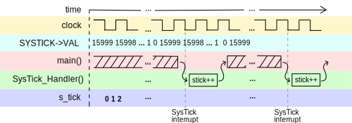
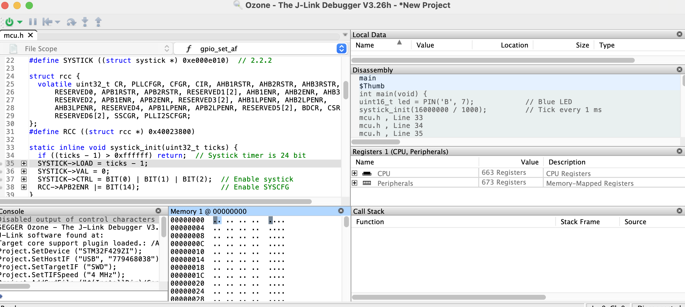
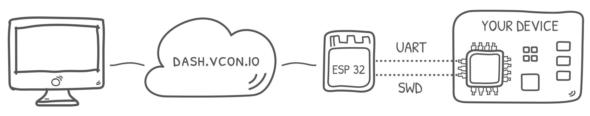
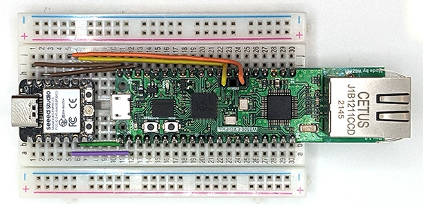
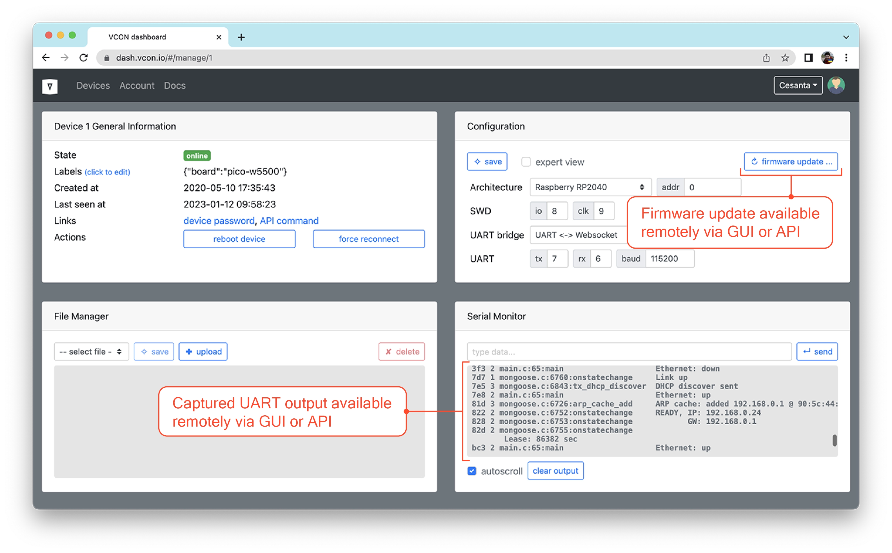

# Sıfırdan programlamaya başlangıç rehberi

[](https://opensource.org/licenses/MIT)
[](https://github.com/cpq/bare-metal-programming-guide/actions)

[English](README.md) | [中文](README_zh-CN.md) | Türkçe

Bu rehber herhangi bir framework kullanmadan sadece GCC derleyicisi ve datasheet kullanarak mikrodenetleyici programlamayı arzulayan geliştiriciler için yazılmıştır. Rehber, Cuce, Keil, Arduino gibi araçların temelinde nasıl çalıştığını ana hatlarıyla açıklamayı amaçlamaktadır.

Bu rehberdeki her bölüm, işlevsellik ve eksiksizlik açısından kademeli olarak ilerleyen kaynakları içerir. Özetle, farklı mimarilerdeki projeleri sıfırdan anlatacağız.

- **blinky** - En klasiklerden biri olan LED yakma ve düzenli olarak debug mesajı yazmak
- **cli** - UART komut satırı arayüzü. LED durumunu ve RAM'in hexdump'ını alan komutları implemente eder.
- **lfs** - Flash memory'nin üst bölümüne [littlefs](https://github.com/littlefs-project/littlefs) kullanarak `mkdir(),readdir(),fopen()` gibi fonksiyonları implemente eder. Cihaz boot sayısını bir dosyada tutar, her boot'ta arttırır ve düzenli olarak yazdırır.
- **webui** - [mongoose library](https://github.com/cesanta/mongoose) sayesinde profesyönel bir cihaz arayüzü sunan gömülü web sunucusu

| Kart                | Arch       | MCU datasheet                                                                                                                                                                                 | Board datasheet                                                                                                               | Örnek proje                                                                                                                  |
| ------------------- | ---------- | --------------------------------------------------------------------------------------------------------------------------------------------------------------------------------------------- | ----------------------------------------------------------------------------------------------------------------------------- | ---------------------------------------------------------------------------------------------------------------------------- |
| STM32 Nucleo-F429ZI | Cortex-M4  | [mcu datasheet](https://www.st.com/resource/en/reference_manual/dm00031020-stm32f405-415-stm32f407-417-stm32f427-437-and-stm32f429-439-advanced-arm-based-32-bit-mcus-stmicroelectronics.pdf) | [board datasheet](https://www.st.com/resource/en/user_manual/dm00244518-stm32-nucleo144-boards-mb1137-stmicroelectronics.pdf) | [blinky](templates/blinky/nucleo-f429zi), [cli](templates/cli/nucleo-f429zi), [webui](steps/step-7-webserver/nucleo-f429zi/) |
| STM32 Nucleo-F303K8 | Cortex-M4  | [mcu datasheet](https://www.st.com/resource/en/reference_manual/DM00043574-.pdf)                                                                                                              | [board datasheet](https://www.st.com/resource/en/datasheet/stm32f303k8.pdf)                                                   | [lfs](templates/lfs/nucleo-f303k8)                                                                                           |
| STM32 Nucleo-L432KC | Cortex-M4  | [mcu datasheet](https://www.st.com/resource/en/reference_manual/dm00151940-stm32l41xxx42xxx43xxx44xxx45xxx46xxx-advanced-armbased-32bit-mcus-stmicroelectronics.pdf)                          | [board datasheet](https://www.st.com/resource/en/datasheet/stm32l432kc.pdf)                                                   | [blinky](templates/blinky/nucleo-l432kc), [cli](templates/cli/nucleo-l432kc), [lfs](templates/lfs/nucleo-l432kc)             |
| TI EK-TM4C1294XL    | Cortex-M4F | [mcu datasheet](https://www.ti.com/lit/ds/symlink/tm4c1294ncpdt.pdf)                                                                                                                          | [board datasheet](https://www.ti.com/lit/ug/spmu365c/spmu365c.pdf)                                                            | [webui](steps/step-7-webserver/ek-tm4c1294xl)                                                                                |
| RP2040 Pico-W5500   | Cortex-M0+ | [mcu datasheet](https://datasheets.raspberrypi.com/rp2040/rp2040-datasheet.pdf)                                                                                                               | [board datasheet](https://docs.wiznet.io/Product/iEthernet/W5500/w5500-evb-pico)                                              | [webui](steps/step-7-webserver/pico-w5500/)                                                                                  |
| ESP32-C3            | RISCV      | [mcu datasheet](https://www.espressif.com/sites/default/files/documentation/esp32-c3_technical_reference_manual_en.pdf)                                                                       |                                                                                                                               | [blinky](templates/blinky/esp32-c3)                                                                                          |

Bu öğreticide **Nucleo-F429ZI** geliştirme kartını kullanacağız bu yüzden mikrodenetleyicinin ve kartın datasheet'lerini indirmeyi unutmayın.

## Hakkımda

Ben Sergey Lyubka, mühendis ve girişimciyim. Ukrayna Kyiv State üniversitesinde fizik lisansı yapıyorum . İrlanda Dublin merkezli Cesanata teknoloji şirketinin kurucu ortağı ve yöneticisiyim. Cesanata'nın geliştirdiği bazı gömülü çözümler:

- https://mongoose.ws - açık kaynaklı HTTP/MQTT/Websocket ağ kütüphanesi
- https://vcon.io - uzaktan firmware güncelleme ve serial monitoring framework'ü

Gömülü ağ programlama konusundaki [ücretsiz web seminerime](https://mongoose.ws/webinars/) davetlisiniz.

## Araçların kurulumu

Çalışmalara devam edebilmek için şunlar gereklidir :

- ARM GCC, https://launchpad.net/gcc-arm-embedded - derleme ve link'leme için
- GNU make, http://www.gnu.org/software/make/ - derlemeyi otomatik hale getirmek için
- ST link, https://github.com/stlink-org/stlink - Flash'lama için
- Git, https://git-scm.com/ - Kodları indirmek ve versiyon kontrolü için

### Mac için kurulum aşamaları

Terminalinizi açın ve şu komutu çalıştırın:

```sh
$ /bin/bash -c "$(curl -fsSL https://raw.githubusercontent.com/Homebrew/install/HEAD/install.sh)"
$ brew install gcc-arm-embedded make stlink git
```

### Linux (Ubuntu) için kurulum aşamaları

Terminalinizi açın ve şu komutu çalıştırın:

```sh
$ sudo apt -y update
$ sudo apt -y install gcc-arm-none-eabi make stlink-tools git
```

### Windows için kurulum aşamaları

- İndirin ve kurun [gcc-arm-none-eabi-10.3-2021.10-win32.exe](https://developer.arm.com/-/media/Files/downloads/gnu-rm/10.3-2021.10/gcc-arm-none-eabi-10.3-2021.10-win32.exe?rev=29bb46cfa0434fbda93abb33c1d480e6&hash=3C58D05EA5D32EF127B9E4D13B3244D26188713C). Kurulum sırasında "Path ekle" seçeneğini aktifleştirin.
- `c:\tools` klasörünü oluşturun.
- [stlink-1.7.0-x86_64-w64-mingw32.zip](https://github.com/stlink-org/stlink/releases/download/v1.7.0/stlink-1.7.0-x86_64-w64-mingw32.zip) indirin ve `bin/st-flash.exe` dosyasını `c:\tools` içine çıkartın.
- [make-4.4-without-guile-w32-bin.zip](https://sourceforge.net/projects/ezwinports/files/make-4.4-without-guile-w32-bin.zip/download) indirin ve `bin/make.exe` dosyasını `c:\tools` içine çıkartın.
- `c:\tools` klasörünü `Path` ortam değişkenine ekleyin.
- Windows 10/11 için "Geliştirici Ayarları"ndan "Simbiyotik link ekleme" özelliğini açın.
- Git'i https://git-scm.com/download/win adresinden indirin. "symlink aktifleştir / Enable symlink" seçeneğini işaretleyin.

### Yüklenmiş araçların kontrolü

An itibariyle tüm gerekli araçlar yüklendi, terminali ya da komut istemcisini açın ve aşağıdaki komutla bu projeyi indirin ve örneği derleyin.

```sh
git clone https://github.com/cpq/bare-metal-programming-guide
cd bare-metal-programming-guide/steps/step-0-minimal
make
```

## Giriş

mikrodenetleyiciler (uC, veya MCU) özünde küçük bilgisayarlardır. Genellikle CPU, RAM,
kodun yükleneceği flash ve bir avuç pin içerirler. Bazı pinler kontrolcüye güç sağlamak
için kullanılır, bunlar çoğunlukla GND (topraklama) ve VCC pini olarak işaretlenir.
Diğer pinler ise yüksek(high) ve alçak(low) voltaj vererek kontrolcü ile haberleşmek
için kullanılır. Haberleşmeden kastedilenlerden en basiti LED yakmaktır. LED'in
bir ayağı GND'ye diğer ayağı ise akım sınırlayıcı direnciyle birlikte bir sinyal
pinine takılır. Yazılım sinyal pinini low ve high yaparak LED'i yakıp söndürür.


### Bellek ve register'lar

Kontrolcü 32-bit'lik adreslenebilir bölge(region)'lere bölünmüştür. Mesela bazı
bellek bölümleri kontrolcünün dahili flash'ının spesifik adresleri ile eşlenmiştir.
Firmware kodu bu bölgeyi kullanarak komutları okur ve çalıştırır. Diğer bir bölüm
ise başka bir spesifik adresle eşlenmiş olan RAM'dir. RAM bölgesine istediğimiz
herhangi bir değeri okuyup yazabiliriz.

STM32F429 datasheet'inin 2.3.1 bölümünü incelediğimizde RAM'in 0x20000000 adresinden
başladığını ve 192KB genişliği bulunduğunu anlarız. 2.4 numaralı bölümde flash'ın ise
0x08000000 adresi ile eşlendiğini görebiliriz. mikrodenetleyicimiz 2MB'lık flash'a
sahip olduğuna göre RAM bölgesi şöyle konumlandırılmıştır:


Datasheet'te baktığımızda bunlardan daha fazla bellek bölgesi olduğunu da fark ederiz
2.3 numaralı "Memmory Map" bölümünde bunların adres aralıkları verilmiştir. Örnek olarak
"GPIOA" bölgesi 0x40020000 adresinden başlayım 1KB uzunluğa sahiptir.

Bu bellek bölgeleri, MCU içindeki farklı "çevre birimlerine" karşılık gelir

- belirli pinlerin özel bir şekilde davranmasını sağlayan devrelerdir.
  Çevresel bellek bölgesi, 32 bitlik register'lardan oluşur.Her register,
  belirli bir adresteki 4 byte'lık hafızayla çevre biriminin belirli bir özelliği
  ile eşleşir Veriler bu adreslere yazılır. Bir başka deyişle verilen adres aralığına
  32 bit yazarak çevre birimine istediğimizi yaptırabiliriz. Register'ları okuyarak
  da çevre biriminin konfigrasyonunu veya gönderdiği veriyi elde edebiliriz.

Birden fazla çevre birimi bulunmaktadır. Bunlardan en basiti MCU'nun pinlerini
"output mode"(çıktı modu) olarak ayarlayıp pine high veya low voltaj vermemizi
veya "input mode"(girdi modu) olarak ayarlayıp pine uygulanan voltajı okumamızı
sağlayan GPIO(genen amaçlı girdi çıktı)'dur. Seri haberleşme protokolünü kullanarak
sadece iki pin ile seri veri almamıza(recive) ve iletmemize(transmit) olanak sağlayan
UART çevre birimi de örnek verilebilir. Bunlar dışındada birsürü birim vardır.

Sıklıkla çevre birimlerinin birden fazla örneği,varyasyonu bulunur. Mesela,
GPIOA, GPIOB MCU'nun farklı pinlerini kontrol ederler. Aynı şekilde UART1, UART2 de
farklı UART kanallarını implemente ederler.Nucleo-F429'de, birden fazla GPIO and UART
çevre birimi bulunur.

GPIOA 0x40020000 adresinden başlar,bölüm 8.4'te GPIO register'larının açıklamalarına ulaşabilirsiniz
Datasheet'in söylediğine göre `GPIOA_MODER` register'ının offset'i 0'dır,bunun anlamı
register'ın adresi `0x40020000 + 0`'dir ve register'ın formatı şu şekildedir:


Datasheet'te 32-bit MODER register'larının toplamda 16 olacak şekilde 2-bit'lik veriler
tuttuğunu görebilirsiniz. Öyleyse bir MODER register'ı 0.pin için 0 ve 1 bitleri,
1.pin için 2 ve 3 bitleri şeklinde devam ederek 16 fiziksel pini kontrol edebilir.
2 bitlik pinin modununa göre 0 girdiyi(input), 1 çıktıyı(output), 2 özel fonksiyonu
(alternate function) -başka bir yerde açıklanan özel işlev- ve 3 ise analog modu ifade eder.
Pinler ise bulunduğu bölgeye uygun yani GPIOA için "A0", "A1" veya GPIOB için "B0", "B1" şeklinde
adlandırılırlar.

Eğer MODER register'ına 32 bit boyunca `0` değerini yazarsak A0'dan A15'e kadar 16 pini de
input moduna göre ayarlamış oluruz.

```c
  * (volatile uint32_t *) (0x40020000 + 0) = 0;  // A0-A15 arasını input olarak ata
```

`volatile` anahtar kelimesini aklınızda tutun bunun anlamına daha sonra değineceğiz.Bitleri
tek tek değiştirerek sadece istediğimiz pinlere mod atayabiliriz. Örnek olarak A3 pinini "output"
olarak ayarlayalım.

```c
  * (volatile uint32_t *) (0x40020000 + 0) &= ~(3 << 6);  // 6-7 aralığını temizle
  * (volatile uint32_t *) (0x40020000 + 0) |= 1 << 6;     // 6-7 aralığını 1 ata
```

Gelin bu bit işlemlerini birlikte inceleyelim. Amacımız, GPIOA çevre biriminin 3.pininden sorumlu olan
bit 6-7'yi belirli bir değere (bizim durumumuzda 1) olacak şekilde atamaktır. Bu işlem iki adımda yapılır.
İlk olarak, 6-7 bitlerinin mevcut değerini silmeliyiz, çünkü daha önceden içinde tuttuğu değer işimizi bozabilir.
Ardından 6-7 bitlerini istediğimiz değere ayarlamalıyız.

Bundan dolayı,ilk önce 6. ve 7. bitleri 0 yapmalıyız.Peki bir sayının belirli bitlerini nasıl sıfır yaparız?
Dört adımla şöyle:

| İşlem                                               | İfade            | Bitler (32 bitin ilk 12'si) |
| --------------------------------------------------- | ---------------- | --------------------------- |
| N tane yan yana biti alın: `2^N-1`, N=2             | `3`              | `000000000011`              |
| O sayıyı X kere sola kaydırın                       | `(3<<6)`         | `000011000000`              |
| Sayıyı tersleyin: Birler sıfır, sıfırlar bir olacak | `~(3<<6)`        | `111100111111`              |
| Sayıyı bitsel VE(AND) işlemine tabi tutun           | `VAL &= ~(3<<6)` | `xxxx00xxxxxx`              |

Son adımı aklınızda tutun, bitsel AND işlemi X yerindeki N tane biti sıfırlar
(çünkü 0 ile AND'lendi) ama geri kalan bitlere dokunmaz(çünkü 1 ile AND'lendi.
Kendisi neyse yeni değeri de o kalacak). Kalan verilere dokunulmaması çok önemlidir çünkü iki
veriyi değiştirmek isterken önceden atanan diğer verileri değiştirmek sistemimizi bozacaktır.
Özetle X pozisyonundaki N tane biti sıfırlamak istiyorsanız yapmanız gereken şudur:

```c
REGISTER &= ~((2^N - 1) << X);
```

Ve artık istediğimiz register ile veriyi birleştirebiliriz. Maskeyi X kere sola kaydırıp register ile OR işlemine tabi tutuyoruz. (OR işlemiyle geri kalan veriler bozulmadan sadece 1 yaptığımız alanları oraya işleyebiliriz)

```c
REGISTER |= VALUE << X;
```

## Okunaklı çevre birlimi programlama

Bir önceki bölümde çevre birimi register'ına doğrudan adresine erişerek okuma
ve yazma yapmayı öğrenmiştik. Gelin bu A3 pinini output moduna alan kodu birlikte
inceleyelim.

```c
  * (volatile uint32_t *) (0x40020000 + 0) &= ~(3 << 6);  // 6-7 bit aralığını temizle
  * (volatile uint32_t *) (0x40020000 + 0) |= 1 << 6;     // 6-7 aralığını 1 ata
```

Oldukça şifreli görünüyor. Herhangi bir yorum satırı olmadan buna benzer kodlar
fazlasıyla zor anlaşılır. Kodumuzu bundan daha okunaklı şekilde yazabiliriz.
Bunun ana fikiri tüm 32 bitlik çevre birimini bir yapı ile göstermektir.
Gelin datasheet'te 8.4 bölümünde bulunan GPIO için tanımlı hangi registerlar
var birlikte bakalım. MODER, OTYPER, OSPEEDR, PUPDR, IDR, ODR, BSRR,
LCKR, AFR ile karşılaşmaktayız. Bunlar ana yapının 0, 4, 8, vb offsetleridirler.
Yani bunları kullanarak 32bitlik alanları temsil edebilir ve GPIOA'yı şu şekilde
tanımlayabiliriz:

```c
struct gpio {
  volatile uint32_t MODER, OTYPER, OSPEEDR, PUPDR, IDR, ODR, BSRR, LCKR, AFR[2];
};

#define GPIOA ((struct gpio *) 0x40020000)
```

Ardından, GPIO pin modu tanımlamak için şöyle bir fonksiyon oluşturalım:

```c
// Dataheet'e göre enum değerleri: 0, 1, 2, 3
enum {GPIO_MODE_INPUT, GPIO_MODE_OUTPUT, GPIO_MODE_AF, GPIO_MODE_ANALOG};

static inline void gpio_set_mode(struct gpio *gpio, uint8_t pin, uint8_t mode) {
  gpio->MODER &= ~(3U << (pin * 2));        // Mevcut ayarları temizle
  gpio->MODER |= (mode & 3) << (pin * 2);   // Yeni modu ata
}
```

Artık A3 pininin modunu şu şekilde output yapabiliriz

```c
gpio_set_mode(GPIOA, 3 /* pin */, GPIO_MODE_OUTPUT);  // A3'ü output olarak ata
```

MCU'muz birden fazla GPIO çevre birimi ("bank" diye de adlandırılır)
içermektedir, bunlar: A, B, C, ..., K.
2.3 bölümünde de görebileeceğimiz gibi birbirlerinden 1KB uzaklıktadırlar.
GPIOA'nın adresi 0x40020000, GPIOB'nin adresi 0x40020400 ise:

```c
#define GPIO(bank) ((struct gpio *) (0x40020000 + 0x400 * (bank)))
```

Pin numarasını ve bank'ını içeren bir numaralandırma oluşturabiliriz.
Bunu yapmak için 2 byte'lık `uint16_t` değerini, üst byte'ı GPIO banklarını
alt byte'ı ise pin numaralarını tutacak şekilde kullanırız.

```c
#define PIN(bank, num) ((((bank) - 'A') << 8) | (num))
#define PINNO(pin) (pin & 255)
#define PINBANK(pin) (pin >> 8)
```

Bu şekilde herhangi bir GPIO bankını pinler için özelleştirebiliriz.

```c
  uint16_t pin1 = PIN('A', 3);    // A3   - GPIOA pin 3
  uint16_t pin2 = PIN('G', 11);   // G11  - GPIOG pin 11
```

Hadi birlikte pin özelleştirmesi için `gpio_set_mode()`fonksiyonunu yazalım:

```c
static inline void gpio_set_mode(uint16_t pin, uint8_t mode) {
  struct gpio *gpio = GPIO(PINBANK(pin)); // GPIO bank
  uint8_t n = PINNO(pin);                 // Pin numarası
  gpio->MODER &= ~(3U << (n * 2));        // Mevcut temizle
  gpio->MODER |= (mode & 3) << (n * 2);   // Yeni modu ata
}
```

İşte karşınızda A3'ün yeni görünümü.

```c
  uint16_t pin = PIN('A', 3);            // Pin A3
  gpio_set_mode(pin, GPIO_MODE_OUTPUT);  // output olarak ata
```

GPIO çevre birimi için yararlı bir başlangıç API'si oluşturduğumuzu unutmayın.
UART (seri iletişim) ve diğerleri gibi diğer çevre birimleri de benzer şekilde
uygulanabilir. Bu, kodu kendi kendini açıklayıcı ve insan tarafından okunabilir
kılan iyi bir programlama uygulamasıdır.

## MCU boot ve vector tablosu

Bir ARM MCU önyükleme(boot) yaptığında, flash belleğinin başında bulunan vektör tablosunu
okur. Vektör tablosu, tüm ARM MCU'lar için ortak bir kavramdır. Bu, kesme
işleyicilerinin 32 bit adreslerinden oluşan bir dizidir. İlk 16 vektör ARM tarafından
ayrılmıştır ve tüm ARM MCU'larında ortaktır. Kesme işleyicilerinin geri kalanı
verilen MCU'ya özeldir -bunlar çevre birimleri için kesme işleyicileridir-.
Birkaç çevre birimli basit MCU'larda az sayıda kesme yakalayıcısı varken MCU
karmaşıklaştıkça bu sayı da artar.

STM32F429 için vektör tablosu Tablo 62'de verilmiştir. Buradan standart 16'ya
ek olarak 91 çevresel işleyici olduğunu görebiliriz.

Vektör tablosundaki her değer, MCU'nun yürüttüğü bir işlevin adresidir.
bir donanım kesmesi (IRQ) tetiklendiğinde. MCU önyükleme sürecinde önemli bir
rol oynayan ilk iki değer istisnadır. Bu değerler şunlardır:
ilk yığın işaretçisi ve yürütülecek önyükleme işlevinin adresi (firmware'in başlangıç noktası).

Artık biliyoruz ki, bellenimimizin flaştaki 2. 32 bitlik değerin bir önyükleme
işlevi adresi içermesi gerektiği şekilde oluşturulması gerektiğinden emin olmalıyız.
MCU önyüklendiğinde, bu adresi flaştan okuyacak ve önyükleme fonksiyonunu çalıştıracaktır.

## Minimal firmware

Bir `main.c` dosyası oluşturalım ve başlangıçta hiçbir şey yapmayan
(sonsuz döngüye düşen) önyükleme fonksiyonumuzu belirleyelim ve 16
standart giriş ve 91 STM32 girişi içeren bir vektör tablosu belirleyelim.
Seçtiğiniz editörde, "main.c" dosyasını oluşturun ve aşağıdakini "main.c"
dosyasına kopyalayın/yapıştırın:

```c
// Startup kodu
__attribute__((naked, noreturn)) void _reset(void) {
  for (;;) (void) 0;  // Sonsuz döngü
}

extern void _estack(void);  // link.ld'de tanımlanmıştır.

// 16 standart ve 91 STM32-specific yakalayıcı
__attribute__((section(".vectors"))) void (*const tab[16 + 91])(void) = {
  _estack, _reset
};
```

`_reset()` fonksiyonu için, GCC'ye özgü `naked` ve `noreturn` attribute'larını kullandık
bunlar standart fonksiyonun giriş ve sonsözünün derleyici tarafından oluşturulmaması
gerektiği ve bu işlevin geri dönmediği anlamına gelir-.

`void (*const tab[16 + 91])(void)` ifadesi şu anlama gelir: 16 + 91 genişlikte,
geriye bir şey döndermeyen(void) ve void argulanı alan bir fonksiyon pointer'ı dizisidir.
Bu fonksiyonlardan her biri bir IRQ fonksiyonudur(Interrupt ReQuest işleyici).
Bu fonksiyonlardan oluşan dizi ise vektör tablosudur.

Vektör tablosu `tab`, `.vector` diye adlandırılan section'a yerleştirilir
-daha sonra bağlayıcıya bu bölümü üretilen ürün yazılımının hemen başına
ve ardından flash belleğin başına koymasını söylememiz gerekiyor-.Vektör
tablosunun geri kalanını sıfırlarla dolu bırakıyoruz.

### Derleme

Hadi kodumuzu derleyelim. Terminali (veya Windows'ta komut istemini) açalım
ve şunu çalıştıralım:

```sh
$ arm-none-eabi-gcc -mcpu=cortex-m4 main.c -c
```

Derleme, hiçbir şey yapmayan minimum aygıt yazılımımızı aşağıdakileri içeren bir `main.o`
dosyasına çevirdi. `main.o` dosyası, birkaç bölümlük ELF binary formatındadır.

Hadi inceleyelim:

```sh
$ arm-none-eabi-objdump -h main.o
...
Idx Name          Size      VMA       LMA       File off  Algn
  0 .text         00000002  00000000  00000000  00000034  2**1
                  CONTENTS, ALLOC, LOAD, READONLY, CODE
  1 .data         00000000  00000000  00000000  00000036  2**0
                  CONTENTS, ALLOC, LOAD, DATA
  2 .bss          00000000  00000000  00000000  00000036  2**0
                  ALLOC
  3 .vectors      000001ac  00000000  00000000  00000038  2**2
                  CONTENTS, ALLOC, LOAD, RELOC, DATA
...
```

Bölümler(section) için VMA/LMA adreslerinin 0'a ayarlandığını unutmayın
-bu, adres alanında bu bölümlerin yüklenmesi gereken bilgileri içermediğinden,
'main.o'nun henüz tam bir sabit yazılım olmadığı anlamına gelir-. `main.o`dan
tam bir `firmware.elf` üretmek için bir bağlayıcı(linker) kullanmamız gerekiyor.

.text bölümü kodu içerir, bizim işin bu sadece `_reset()` fonksiyonudur.
2 bayt uzunluğu kendi adresine atlama talimatı içerdiğinden gelmektedir. Orada
boş bir `.data` bölümü ve boş bir `.bss` bölümü (sıfır olarak başlatılan veriler).
Firmware'imizin, 0x8000000 ofsetindeki flash bölgesine kopyalanacak, ancak
veri bölümümüz RAM'de bulunacaktır -bu nedenle `_reset()` işlevimiz `.data` bölümünün
içeriğini RAM'e kopyalamalıdır-. Ayrıca `.bss`nin tamamına sıfır yazmalıdır.
`.data` ve `.bss` bölümleri boş, ancak yine de `_reset()` işlevimizi düzgün
bir şekilde işlemek için değiştirelim.

Tüm bunları yapabilmek için, yığının(stack) nerede başladığını, data ve bss
bölümlerinin nerede başladığını bilmeliyiz. Bunu adres alanında çeşitli bölümlerin
nereye yerleştirileceğini ve hangi sembollerin oluşturulacağını içeren
bir dosya olan "linker script" içinde belirtebiliriz.

### Linker script

`link.ld` adında bir dosya oluşturun ve içine şunu yapıştırın [steps/step-0-minimal/link.ld](steps/step-0-minimal/link.ld).

Gelin adım adım ne olduklarını açıklayalım:

```
ENTRY(_reset);
```

Bu satır, oluşturulan ELF başlığındaki "entiry point" özniteliğinin değerini
linker'a söyler -yani bu, vektör tablosunun sahip olduğu şeyin bir kopyasıdır-.
Bu, debogger'a firmware'in başlangıcına breakpoint koymasına yardımcı olur.
Debugger vektör tablosu hakkında bir şey bilemed, bu nedenle ELF başlığına ihtiyaç duyar.

```
MEMORY {
  flash(rx)  : ORIGIN = 0x08000000, LENGTH = 2048k
  sram(rwx) : ORIGIN = 0x20000000, LENGTH = 192k  /* 64k'lık bölünmüş bir alan olduğunu hatırlatır */
}
```

Bu satır linker'a iki bellek bölgemiz olduğunu, bellek bölgelerinin adreslerini
ve boyutlarını söyler.

```
_estack     = ORIGIN(sram) + LENGTH(sram);    /* stack'e SRAM'in sonunu işaret ettirir */
```

Bu satır linker'a RAM bölgesinin en sonlarına doğru bir `estack` sembolü oluşturtur.
Bu bizim varsayılan stack değerimiz olacaktır.!

```
  .vectors  : { KEEP(*(.vectors)) }   > flash
  .text     : { *(.text*) }           > flash
  .rodata   : { *(.rodata*) }         > flash
```

Bu satırlar, bağlayıcıya önce vektör tablosunu flash'a koymasını, ardından `.text` bölümünü (firmware kodu), ardından sa read-only veri olan `.rodata`yı koymasını söyler.

Sonda da `.data` bölümü gelir:

```
  .data : {
    _sdata = .;   /* .data bölümünün başlangıcı */
    *(.first_data)
    *(.data SORT(.data.*))
    _edata = .;  /* .data bölümünün bitimi */
  } > sram AT > flash
  _sidata = LOADADDR(.data);
```

Bağlayıcıya `_sdata` ve `_edata` sembolleri oluşturmasını söylediğimize
dikkat edin. Bunları, `_reset()` işlevinde veri bölümünü
RAM'e kopyalamak için kullanacağız.

`.bss` bölümü de benzer şekilde:

```
  .bss : {
    _sbss = .;              /* .bss bölümünün başlangıcı */
    *(.bss SORT(.bss.*) COMMON)
    _ebss = .;              /* .bss bölümünün bitimi */
  } > sram
```

### Startup kodu

Artık `_reset()` fonksiyonumuzu güncelleyebiliriz. `.data` kısmını RAM'e kopyalıyoruz ve bss kısmını sıfırlıyoruz. Ardından, main() işlevini çağırırız ve main()'den return edilene kadar sonsuz döngüye giriyor:

```c
int main(void) {
  return 0; // Şimdilik bir şey yapmayalım
}

// Başlangıç kodu
__attribute__((naked, noreturn)) void _reset(void) {
  // .bss'e 0 ata ve .data'yı RAM'e kopyala
  extern long _sbss, _ebss, _sdata, _edata, _sidata;
  for (long *dst = &_sbss; dst < &_ebss; dst++) *dst = 0;
  for (long *dst = &_sdata, *src = &_sidata; dst < &_edata;) *dst++ = *src++;

  main();             // main()' çağır
  for (;;) (void) 0;  // main'den return gelene kadar sonsuz döngü
}
```

aşağıdaki diyagram `_reset()`'in .data ve .bss'i nasıl yükeldiğini gösteriyor:


`firmware.bin` dosyası, yalnızca şu üç bölümün birleşiminden oluşur:
`.vectors` (IRQ vektör tablosu), `.text` (kod) ve `.data` (veri).
Bu bölümler linker script dosyasına göre oluşturulmuştur:
`.vectors` flash'ın en başında yer alır, hemen ardından `.text` gelir
ve çok yukarısında `.data` yer alır. `.text` içindeki adresler flaş bölgesindedir
ve `.data` içindeki adresler RAM bölgesindedir. Bazı işlevlerin adresi
varsa, örn. `0x8000100`, ardından flash'ta tam olarak bu adreste
bulunur. Ancak kod, `.data` bölümündeki bazı değişkenlere adresle
erişirse, örn. `0x20000200`, o zaman o adreste hiçbir şey yoktur,
çünkü açılışta `firmware.bin` içindeki `.data` bölümü flash'ta bulunur!
Bu nedenle başlangıç kodunun `.data` bölümünü flash bölgesinden
RAM bölgesine taşıması gerekir.

Artık komple bir `firmware.elf` dosyası üretmeye hazırız

```sh
$ arm-none-eabi-gcc -T link.ld -nostdlib main.o -o firmware.elf
```

Hadi firmware.elf dosyasının parçalarına bakalım:

```sh
$ arm-none-eabi-objdump -h firmware.elf
...
Idx Name          Size      VMA       LMA       File off  Algn
  0 .vectors      000001ac  08000000  08000000  00010000  2**2
                  CONTENTS, ALLOC, LOAD, DATA
  1 .text         00000058  080001ac  080001ac  000101ac  2**2
                  CONTENTS, ALLOC, LOAD, READONLY, CODE
...
```

Şimdi .vectors bölümünün flash belleğin en başında olan 0x8000000 adresinde,
ardından 0x80001ac adresinde hemen sonra .text bölümünün yer alacağını
görebiliriz. Henüz .data bölümü olmadığı için kodumuz herhangi bir değişken
oluşturamaz.

## Firmware yükleme

Firmware'i yüklemeye hazırız. İlk önce firmware.elf dosyasından bölümleri
çıkarıp tek bir binary dosyasında toplamalıyız.:

```sh
$ arm-none-eabi-objcopy -O binary firmware.elf firmware.bin
```

`st-link` kullanarak firmware.bin dosyasını yükleyelim. Kartınızı USB ile bağlayın
ve şunu çalıştırın:

```sh
$ st-flash --reset write firmware.bin 0x8000000
```

Sonunda! Sonunda hiçbir şey yapmayan yazılımımızı kartımıza yükledik.

## Makefile: derleme otomasyonu

Şu ana kadarki, linkleme ve yükleme komutlarını yazmak yerine,
tüm süreci otomatikleştirmek için `make` komut satırı aracını
kullanabiliriz.`make` yardımcı programı, eylemlerin nasıl yürütüleceğine
ilişkin talimatları okuduğu `Makefile` adlı bir yapılandırma
dosyası kullanır. Bu otomasyon harika çünkü aynı zamanda sabit
yazılım, kullanılan derleme flag'ları vb. oluşturma sürecini de dokümante eder.

https://makefiletutorial.com adresinde harika bir Makefile eğitimi
var. `make` konusunda yeni olanlar için bir göz atmalarını öneririm.
Aşağıda, basitçe sıfırdan Makefile'imizi anlamak için gereken
en temel kavramları listeliyorum. `make` kelimesini zaten bilenler
bu bölümü atlayabilir.

Basitçe `Makefile` formatı:

```make
islem1:
	komut ...     # Hash işaretinden sonra yorum yazılabilir
	komut ....    # ÖNEMLİ UYARI: komutlardan önce TAB karakteri gelmek zorundadur

islem2:
	komut ...     # TAB koymayı unutma! Space ile çalışmaz.
```

Artık `make` ile istediğiniz işlemin ismini vererek onu tetikleyebilirsiniz.

```sh
$ make islem1
```

Değişkenler tanımlamak ve onları komutlarda kullanmak da mümkündür.
Aynı zamanda işlemler oluşturulması gereken dosya adları da olabilir.

```make
firmware.elf:
	DERLEME KOMUTU .....
```

Ve bir işlem diğer işlemlere de bağımlı olabilir. Örnek olarak
`firmware.elf` kaynak dosyamız olan `main.c`'ye bağımlıdır. `main.c`
dosyası ne zaman değişirse `make build` komutu `firmware.elf`'i de
tekrardan çalıştırır.

```
build: firmware.elf

firmware.elf: main.c
	DERLEME KOMUTU
```

Artık firmware'imiz için Makefile yazmaya hazırız. `build` komutunu tanımlayalım.

```make
CFLAGS  ?=  -W -Wall -Wextra -Werror -Wundef -Wshadow -Wdouble-promotion \
            -Wformat-truncation -fno-common -Wconversion \
            -g3 -Os -ffunction-sections -fdata-sections -I. \
            -mcpu=cortex-m4 -mthumb -mfloat-abi=hard -mfpu=fpv4-sp-d16 $(EXTRA_CFLAGS)
LDFLAGS ?= -Tlink.ld -nostartfiles -nostdlib --specs nano.specs -lc -lgcc -Wl,--gc-sections -Wl,-Map=$@.map
SOURCES = main.c

build: firmware.elf

firmware.elf: $(SOURCES)
	arm-none-eabi-gcc $(SOURCES) $(CFLAGS) $(LDFLAGS) -o $@
```

Gördüğünüz üzere derleme flag'larını tanımladık. `?=`'nin anlamı bunu
varsayılan değer olduğu ve komut satırından ezmemize olanak sağladığıdır.

```sh
$ make build CFLAGS="-O2 ...."
```

`CFLAGS`, `LDFLAGS` ve `SOURCES` değişkenlerini tanımladık.
`make`'e şunu dedik: `build` yapmanız istenirse, bir `firmware.elf`
dosyası oluşturun. `main.c` dosyasına bağlıdır ve onu oluşturmak
için `arm-none-eabi-gcc` derleyicisini verilen flag'larla çalıştır.
`$@` özel değişkeni bir hedef adına genişler - bizim durumumuzda `firmware.elf`.

Hadi `make`'i çalıştıralım:

```
$ make build
arm-none-eabi-gcc main.c  -W -Wall -Wextra -Werror -Wundef -Wshadow -Wdouble-promotion -Wformat-truncation -fno-common -Wconversion -g3 -Os -ffunction-sections -fdata-sections -I. -mcpu=cortex-m4 -mthumb -mfloat-abi=hard -mfpu=fpv4-sp-d16  -Tlink.ld -nostartfiles -nostdlib --specs nano.specs -lc -lgcc -Wl,--gc-sections -Wl,-Map=firmware.elf.map -o firmware.elf
```

Eğer tekrardan çalıştırırsanız

```sh
$ make build
make: Nothing to be done for `build'.
```

`make` programı, `main.c` bağımlılığı ve `firmware.elf` için
değişiklik zamanlarını inceler ve şu durumlarda hiçbir şey yapmaz:
`firmware.elf` güncelse ancak `main.c`yi değiştirirsek, sonraki
`make build` komutunda yeniden derlenir:

```sh
$ touch main.c # main.c'deki değişikli simüla ediyoruz
$ make build
```

Peki şimdi geriye ne kaldı? Tabii ki `flash` komutu

```make
firmware.bin: firmware.elf
	arm-none-eabi-objcopy -O binary $< $@

flash: firmware.bin
	st-flash --reset write $< 0x8000000
```

Bu kadar! Şimdi, `make flash` terminal komutu bir
`irmware.bin` dosyasını kopyalar ve onu yükler. `main.c`
değişirse sabit yazılımı yeniden derler, çünkü `firmware.bin`
`firmware.elf`'e bağlıdır ve o da `main.c`ye bağlıdır. Yani,
şimdi yaptığınızda şu iki eylem olacaktır:

```sh
# main.c içinde geliştirme yaptıktan sonra
$ make flash
```

Hedef dosyaları temizleyecek `clean` komutunu eklemek artık iyi bir fikir

```
clean:
	rm -rf firmware.*
```

Projenin tamamlanmış halini [steps/step-0-minimal](steps/step-0-minimal) klasöründe bulabilirsiniz.

## LED yakma

Şimdi tüm derleme / flash altyapısını kurduğumuza göre,firmware'imizle kullanışlı
bir şeyler yapmasını öğretme zamanı. Elektronikten kullanışlı şey elbette LED'i
yakıp sökmektir. Bir Nucleo-F429ZI kartında üç dahili LED bulunur.
Nucleo kartı datasheet'inin bölüm 6.5'ünde dahili LED'lerin hangi pinlere

- PB0: yeşil LED
- PB7: mavi LED
- PB14: kırmızı LED

Hadi `main.c` dosyasını düzenleyelim ve PIN ve `gpio_set_mode()` tanımlamalarımızı yapalım.
`main()` fonksiyonunda mavi LED'i çıkış moduna ayarlıyoruz ve sonsuz bir döngü başlatıyoruz.
İlk olarak, daha önce konuştuğumuz pinler ve GPIO tanımlarını kopyalayalım.
Ayrıca `BIT(konum)` makrosunu eklediğimizi unutmayın:

```c
#include <inttypes.h>
#include <stdbool.h>

#define BIT(x) (1UL << (x))
#define PIN(bank, num) ((((bank) - 'A') << 8) | (num))
#define PINNO(pin) (pin & 255)
#define PINBANK(pin) (pin >> 8)

struct gpio {
  volatile uint32_t MODER, OTYPER, OSPEEDR, PUPDR, IDR, ODR, BSRR, LCKR, AFR[2];
};
#define GPIO(bank) ((struct gpio *) (0x40020000 + 0x400 * (bank)))

// Datasheet'e göre enum değerleri: 0, 1, 2, 3
enum { GPIO_MODE_INPUT, GPIO_MODE_OUTPUT, GPIO_MODE_AF, GPIO_MODE_ANALOG };

static inline void gpio_set_mode(uint16_t pin, uint8_t mode) {
  struct gpio *gpio = GPIO(PINBANK(pin));  // GPIO bank
  int n = PINNO(pin);                      // Pin numarası
  gpio->MODER &= ~(3U << (n * 2));         // Mevcut değeri temizle
  gpio->MODER |= (mode & 3) << (n * 2);    // Yeni modu ata
}
```

Bazı mikrodenetleyiciler, çalıştırıldıklarında, tüm çevre birimlerine
otomatik olarak güç verilir ve etkinleştirilir. Ne yazıkki, STM32 MCU'lar,
güç tasarrufu yapmak için varsayılan olarak çevre birimlerini devre
dışı bırakmıştır. Bir GPIO çevre birimini etkinleştirmek için,
RCC (Sıfırlama ve Saat Kontrolü) birimi aracılığıyla etkinleştirilmelidir(saatli).
Datasheet'in 7.3.10 numaralı bölümünde, AHB1ENR'nin (AHB1 çevresel saat etkinleştirme kaydı)
GPIO bankalarını açıp kapatmaktan sorumlu olduğunu görüyoruz.
Önce biz tüm RCC birimi için bir tanım ekleyin:

```c
struct rcc {
  volatile uint32_t CR, PLLCFGR, CFGR, CIR, AHB1RSTR, AHB2RSTR, AHB3RSTR,
      RESERVED0, APB1RSTR, APB2RSTR, RESERVED1[2], AHB1ENR, AHB2ENR, AHB3ENR,
      RESERVED2, APB1ENR, APB2ENR, RESERVED3[2], AHB1LPENR, AHB2LPENR,
      AHB3LPENR, RESERVED4, APB1LPENR, APB2LPENR, RESERVED5[2], BDCR, CSR,
      RESERVED6[2], SSCGR, PLLI2SCFGR;
};
#define RCC ((struct rcc *) 0x40023800)
```

AHB1ENR register dokümanına göre 0'dan 8'e kadar olan bitler
GPIOA - GPIOE bankaları için saati ayarlar :

```c
int main(void) {
  uint16_t led = PIN('B', 7);            // mavi LED
  RCC->AHB1ENR |= BIT(PINBANK(led));     // LED için saati aktifleştirme
  gpio_set_mode(led, GPIO_MODE_OUTPUT);  // Mavi LED'i output olarak ayarlama
  for (;;) (void) 0;                     // sonsuz döngü
  return 0;
}
```

Şimdi geriye kalan şey, bir GPIO pininin nasıl açılıp kapatılacağını
bulmak ve ardından bir LED pinini açmak, geciktirmek, kapatmak,
geciktirmek için ana döngüyü değiştirmek. Veri sayfası bölüm 8.4.7'ye baktığımızda,
BSRR kaydının voltajı yüksek veya düşük ayarlamaktan sorumlu olduğunu
görüyoruz. Düşük 16 bit, ODR kaydını ayarlamak için kullanılır
(yani, yüksek pin ayarı) ve yüksek 16 bit, ODR kaydını sıfırlamak için
kullanılır (yani, düşük pin ayarı). Bunun için bir API fonksiyonu tanımlayalım:

```c
static inline void gpio_write(uint16_t pin, bool val) {
  struct gpio *gpio = GPIO(PINBANK(pin));
  gpio->BSRR = (1U << PINNO(pin)) << (val ? 0 : 16);
}
```

Şimdi artık bekleme fonksiyonunu tanımlama zamanımız geldi. Şu anlık özel bir
gecikme fonksiyonuna ihtiyacımız yok. `spin()` fonksiyonu ile verilen
kez kadar NOP(no operation) işlemini yapacak fonksiyon tanımlalamız
yeterli olacaktır;

```c
static inline void spin(volatile uint32_t count) {
  while (count--) (void) 0;
}
```

Sonunda döngümüzü LED yakıp söndürmek için güncellemeye hazırız:inking:

```c
  for (;;) {
    gpio_write(led, true);
    spin(999999);
    gpio_write(led, false);
    spin(999999);
  }
```

`make flash` komutunu çalıştırın ve arkanıza yaslanıp LED'in keyfini sürün.
Projenin tamamına [steps/step-1-blinky](steps/step-1-blinky) klasöründen ulaşabilirsiniz.

## SysTick kesmesi ile Blink

Doğru bir zaman tutma uygulamak için ARM'nin SysTick kesmesini(interrupt) etkinleştirmeliyiz.
SysTick 24 bitlik bir donanım sayacıdır ve ARM çekirdeğinin bir parçasıdır,
dolayısıyla ARM datasheet'inde dokümante edilmiştir.Datasheet'e baktığımızda,
SysTick'in dört adet register'ı olduğunu görüyoruz:

- CTRL - systick'i açıp kapatmak için kullanılır
- LOAD - sayaca başlangıç değerini yükler
- VAL - şu anki sayaç değeri, her clock'ta bir azaltılır
- CALIB - calibrasyon register'ı

VAL her sıfır olduğunda bir SysTick kesmesi oluşturulur.
Bu interrupt'ın vektör tablosundaki değeri 15'tir, bu yüzden onu doldurmalıyız.
Nucleo-F429ZI kartı 16Mhz ile kod koşturur bu sayede SysTick sayacını
her milisaniyede çalışacak şekilde tetikletebiliriz.

İlk önce hadi SysTick çevre birimini tanımlayalık. Bildiğimiz üzere 4 adet
register'ı vardı ve SysTick adresi 0xe000e010'idi. O zaman:

```c
struct systick {
  volatile uint32_t CTRL, LOAD, VAL, CALIB;
};
#define SYSTICK ((struct systick *) 0xe000e010)
```

Ardından, bunu konfigre edebilecğeimiz bir API ekleyelim. İlk önce
`SYSTICK->CTRL` register'ı ile SysTick'i devreye sokmalıyız ve
`RCC->APB2ENR` sayacını dokümanda 7.4.14 bölümünde tanımlandığı
gibi kullanmalıyız.

```c
#define BIT(x) (1UL << (x))
static inline void systick_init(uint32_t ticks) {
  if ((ticks - 1) > 0xffffff) return;  // Systick timer'ı 24 bittir
  SYSTICK->LOAD = ticks - 1;
  SYSTICK->VAL = 0;
  SYSTICK->CTRL = BIT(0) | BIT(1) | BIT(2);  // systick'i devreye al
  RCC->APB2ENR |= BIT(14);                   // SYSCFG'yi devreye al
}
```

Varsayılan olarak Nucleo-F429ZI kartı 16Mhz ile kodu koşturduğu için
`systick_init(16000000 / 1000);` çağrısı yaptığımızda 1 milisaniyede
tetikleneceğini garanti eder. Bir tane kesme yakalayıcısı tanımlamalıyız.
Burada basit bir 32 bir milisaniye sayıcı görünmektedir:

```c
static volatile uint32_t s_ticks; // volatile olması önemli!!
void SysTick_Handler(void) {
  s_ticks++;
}
```

16Mhz'lik saat ile SysTick her 16000 döngüde tetiklenecektir.
`SYSTICK->VAL`'in varsayılan değeri 15999'dur ve her döngüde
birer birer azalır ve 0 olduğunda kesme üretir. Firmware kodunun
yürütülmesi durdurulur ve `SysTick_Handler()` fonksiyonu tetiklenir.
O da `s_ticks` değerini arttırır. Burada zaman aralığında nasıl göründüğüne bakalım:



`volatile` tanımlayıcısı burada gereklidir çünkü `s_ticks` değeri kesme ile
güncellenir. `volatile` tanımlayıcısı derleyiciye optimizasyon/cache'leme
için `s_ticks` değişkenini register'a çekmemesini söyler. Oluşturulan kod
her zaman bellekten veriye erişir. Bu yüzden çevre birimi yapılarında bolca
kullanılır. Bunu anlamanız oldukça önemlidir, hadi gelin bunun Arduino'nun `delay()`
fonksiyonla bizim `s_ticks` ile kıyaslayalım:

```c
void delay(unsigned ms) {            // bu fonksiyon "ms" kadar milisaniye bekler
 uint32_t until = s_ticks + ms;      // Durmamız gereken zamanı hesaplayalım
 while (s_ticks < until) (void) 0;   // bitene kadar döngü
}
```

Şimdi bunu `s_ticks`'te `volatile` tanımlayıcısı olmadan derleyelim ve makine koduna bakalım:

```
// NO VOLATILE: uint32_t s_ticks;       |  // VOLATILE: volatile uint32_t s_ticks;
                                        |
 ldr     r3, [pc, #8]  // cache s_ticks |  ldr     r2, [pc, #12]
 ldr     r3, [r3, #0]  // in r3         |  ldr     r3, [r2, #0]   // r3 = s_ticks
 adds    r0, r3, r0    // r0 = r3 + ms  |  adds    r3, r3, r0     // r3 = r3 + ms
                                        |  ldr     r1, [r2, #0]   // RELOAD: r1 = s_ticks
 cmp     r3, r0        // ALWAYS FALSE  |  cmp     r1, r3         // compare
 bcc.n   200000d2 <delay+0x6>           |  bcc.n   200000d2 <delay+0x6>
 bx      lr                             |  bx      lr
```

`volatile` olmayan `delay()` fonksiyonu hiçbir zaman çıkmayacak ve sonsuza
kadar dönecektir çünkü optimizasyon için `s_ticks`'in değeri register'da
cache'lenir ve asla güncellenmez. Derleyici bu değişkenin başka bir yerde
-kesme gibi- değişceğini bilmediği için yapar.

`volatile` olan fonksiyonda her döngüde `s_ticks`'in değeri register'dan istenir.
Yani altın kuralımız şudur:
**bellekteki interrupt handler yahut donanım tarafından güncellenen veriler her zaman `volatile` olarak tanımlanmalıdır**

Artık `volitale` kullanmamızın nedenini öğrendiğimize göre `SysTick_Handler()` kesme yakalayıcısını vektör tablosuna ekleyebiliriz.

```c
__attribute__((section(".vectors"))) void (*const tab[16 + 91])(void) = {
    _estack, _reset, 0, 0, 0, 0, 0, 0, 0, 0, 0, 0, 0, 0, 0, SysTick_Handler};
```

Elimizde artık saniye bazlı bir saatimiz var. Gelin periyodik zamanlar
için de bir yardımcı fonksiyon yazalım

```c
// t: bitiş zamanı, prd: periyod, now: şu an. Eğer zaman geçtiyse true döner
bool timer_expired(uint32_t *t, uint32_t prd, uint32_t now) {
  if (now + prd < *t) *t = 0;                    // Time wrapped? Reset timer
  if (*t == 0) *t = now + prd;                   // First poll? Set expiration
  if (*t > now) return false;                    // Not expired yet, return
  *t = (now - *t) > prd ? now + prd : *t + prd;  // Next expiration time
  return true;                                   // Expired, return true
}
```

Now we are ready to update our main loop and use a precise timer for LED blink.
For example, let's use 250 milliseconds blinking interval:

```c
  uint32_t timer, period = 500;          // Declare timer and 500ms period
  for (;;) {
    if (timer_expired(&timer, period, s_ticks)) {
      static bool on;       // This block is executed
      gpio_write(led, on);  // Every `period` milliseconds
      on = !on;             // Toggle LED state
    }
    // Here we could perform other activities!
  }
```

SysTick ve bir yardımcı 'timer_expired()' işlevini kullanarak, ana döngümüzü
(superloop olarak da adlandırılır) non-blocking hale getirdiğimize dikkat
edin. Bu, bu döngü içinde birçok işlem gerçekleştirebileceğimiz anlamına
gelir - örneğin, farklı dönemlere sahip farklı zamanlayıcılara sahip olabiliriz
ve bunların tümü zamanında tetiklenecektir.

Projenin tamamına [steps/step-2-systick](steps/step-2-systick) klasöründen ulaşabilirsiniz..

## UART debug çıktısı ekleme

Şimdi frimware'imize insanlar tarafından okunabilen bir çıktı ekleme zamanı.
MCU çevre birimlerinden biri seri UART arabirimidir. Datasheet'te bölüm 2.3'e
baktığımızda, birkaç UART/USART denetleyicisi olduğunu görüyoruz
-yani MCU içinde uygun şekilde yapılandırılmış, belirli
pinler aracılığıyla veri alışverişi yapabilen devre parçaları-. Minimum bir
UART kurulumunda, RX (alma) ve TX (iletim) olmak üzere iki pin kullanır.

Bir Nucleo kartı datasheet'inde bölüm 6.9'da, denetleyicilerden biri olan
USART3'ün PD8 (TX) ve PD9 (RX) pinlerini kullandığını ve yerleşik
ST-LINK hata ayıklayıcısına bağlı olduğunu görüyoruz.Bu, USART3'ü
yapılandırırsak ve verileri PD9 pini aracılığıyla aktarırsak ST-LINK
USB bağlantısı aracılığıyla bilgisayarımızdan okuyabiliriz.

Bu da bize UART için GPIO ile birlikte bir API oluşturmayı gerektirtiyor.
Datasheet'in 30.6 bölümü UART register'larını şöyle özetliyor:

```c
struct uart {
  volatile uint32_t SR, DR, BRR, CR1, CR2, CR3, GTPR;
};
#define UART1 ((struct uart *) 0x40011000)
#define UART2 ((struct uart *) 0x40004400)
#define UART3 ((struct uart *) 0x40004800)
```

UART'ı konfigre etmemiz için:

- `RCC->APB2ENR` register'ı ile UART saatini devreye sokmamız.
- RX ve TX pinlerini "alternatif fonksiyon" moduyla tanımlamamız.
  Verilen pinlerin çevre birimlerine göre birden fazla Alternatif fonksiyon(AF) bulunmaktadır. AF listesine tablo 12'den erişebilirsiniz [STM32F429ZI](https://www.st.com/resource/en/datasheet/stm32f429zi.pdf)
- BRR register'ı ile bound rate (okuma/yazma bit hızı) ayarlanması
- CRR register'ı ile çevre biriminin aktif hale getirilmesi

Artık istediğimiz GPIO modunu nasıl atayacağımızı bildiğimize göre hızlıca
işe başlayalım. Eğer bir pin AF modundaysa onun fonksiyon numarasını
da belirlememiz gerekmektedir. Örnek olarak hangi çevre biriminin
kontrolünde olduğu gibi. Bu işlem GPIO'nun alternatif fonksiyon register(`ARF`)'ı
ile yapılır. Datasheet'ten AFR açıklamasını okuduğumuzda 4 bitlik
sayıdan oluştuğunu görebiliriz. Bu da 16 pin için 2 register'ı ayarlamamız gerektiğini gösterir

```c
static inline void gpio_set_af(uint16_t pin, uint8_t af_num) {
  struct gpio *gpio = GPIO(PINBANK(pin));  // GPIO bank
  int n = PINNO(pin);                      // Pin numarası
  gpio->AFR[n >> 3] &= ~(15UL << ((n & 7) * 4));
  gpio->AFR[n >> 3] |= ((uint32_t) af_num) << ((n & 7) * 4);
}
```

Hali hazırda bulunan kodda register register-sepecific kodları gizlenmiş halde,
hadi GPIO saatini `gpio_set_mode()` fonksiyonunda başlatalım.

```c
static inline void gpio_set_mode(uint16_t pin, uint8_t mode) {
  struct gpio *gpio = GPIO(PINBANK(pin));  // GPIO bank
  int n = PINNO(pin);                      // Pin numarası
  RCC->AHB1ENR |= BIT(PINBANK(pin));       // GPIO Clock'unu aktifleştirme
  ...
```

UART'ı başlatacak API fonksiyonu için şu an tüm ortam hazır.

```c
#define FREQ 16000000  // CPU frekansı, 16 Mhz
static inline void uart_init(struct uart *uart, unsigned long baud) {
  // https://www.st.com/resource/en/datasheet/stm32f429zi.pdf
  uint8_t af = 7;           // alternatif fonksiyon
  uint16_t rx = 0, tx = 0;  // pinler

  if (uart == UART1) RCC->APB2ENR |= BIT(4);
  if (uart == UART2) RCC->APB1ENR |= BIT(17);
  if (uart == UART3) RCC->APB1ENR |= BIT(18);

  if (uart == UART1) tx = PIN('A', 9), rx = PIN('A', 10);
  if (uart == UART2) tx = PIN('A', 2), rx = PIN('A', 3);
  if (uart == UART3) tx = PIN('D', 8), rx = PIN('D', 9);

  gpio_set_mode(tx, GPIO_MODE_AF);
  gpio_set_af(tx, af);
  gpio_set_mode(rx, GPIO_MODE_AF);
  gpio_set_af(rx, af);
  uart->CR1 = 0;                           // UART'ı kapatma
  uart->BRR = FREQ / baud;                 // FREQ,  UART'ın bus frekansı
  uart->CR1 |= BIT(13) | BIT(2) | BIT(3);  // UE, RE, TE atama
}
```

Ve son olarak UART ile okuma ve yazma fonksiyonları kaldı.
Datasheet'in 30.6.1 bölümü bize durum ragister'ı olan SR'nin
veri hazır olduğunda set edilmiş olacağını söylüyor

```c
static inline int uart_read_ready(struct uart *uart) {
  return uart->SR & BIT(5);  // Eğer RXNE biti atandıysa veri hazırdır.
}
```

Veri bayt'ı veri register'ı DR içinden doğrudan çekilebilir

```c
static inline uint8_t uart_read_byte(struct uart *uart) {
  return (uint8_t) (uart->DR & 255);
}
```

Veri register'ı ile bir btye veri de iletilebilir. Veri yazıldıktan sonra
status register'ındaki 7.bit set edilene kadar bekleyip iletimin bittiğinden
emin olmamız gerekir.

```c
static inline void uart_write_byte(struct uart *uart, uint8_t byte) {
  uart->DR = byte;
  while ((uart->SR & BIT(7)) == 0) spin(1);
}
```

Buffer'ı yazma:

```c
static inline void uart_write_buf(struct uart *uart, char *buf, size_t len) {
  while (len-- > 0) uart_write_byte(uart, *(uint8_t *) buf++);
}
```

Artık main() fonksiyonumuzda uart'ı başlatabiliriz.

```c
  ...
  uart_init(UART3, 115200);              // UART'ı başlatır
```

Şimdi, LED her yandığında "hi\r\n" yazmaya hazırız

```c
    if (timer_expired(&timer, period, s_ticks)) {
      ...
      uart_write_buf(UART3, "hi\r\n", 4);  // Write message
    }
```

Yeniden derleyip, tekrardan yükleyip programı ST-LINK ile termilane bağlayın.
Mac ve Linux bilgisayarlarda, ben `cu` kullanıyorum. Windowsta ise `putty`
kullanmak iyi bir tercih olabilir. programı çalıştırdığınızda şöyle bir
mesaj göreceksiniz:

```sh
$ cu -l /dev/BURAYA_SERI_PORTUNUZ_GELECEK -s 115200
hi
hi
```

Projenin tam haline [steps/step-3-uart](steps/step-3-uart) klasöründen ulaşabilirsiniz.

## prinf()'i UART'a uyarlama

Bu bölümde `uart_write_buf()` çağrısını bize formatlanmış çıktı veren `prinf()` çağrısı
ile değiştireceğiz. Bu bizim bilgi yazabilme yeteneğimizi arttıracak ve
"printf-style debuging"'i implemente etmemizi sağlayacak.

GNU ARM toolchain'i sadece bizim kullandığımız GCC derleyicisi veya diğer
araçlarla gelmiyor, RedHat tarafından gömülü sistemler için geliştirilen
newlib adındaki C kütüphanesiyle de geliyor.

In this section, we replace `uart_write_buf()` call by `printf()` call, which
gives us an ability to do formatted output - and increase our abilities to
print diagnostic information, implemeting so called "printf-style debugging".
https://sourceware.org/newlib

Firmware'imiz `strcmp()` gibi standart C fonksiyonlarını çağırdığında newlib
kodu GCC linker'ı ile firmware'imze eklenir.

newlib'in standart C kütüphanesinden implemente ettiği özellikle de dosya
girdi/çıktı(IO) işlemleri gibi işlemler newlib tarafından kendine has bir
şekilde yapılmaktadır. Bu fonksiyanlar düşük seviyeli IO fonksiyonları olan
"syscalls" yani sistem çağrılarını kullanırlar.

Örnek olarak:

- `fopen()` nihayetinde `_open()` fonksiyonunu çağırır
- `fread()` `_read()` fonksiyonunu çağırır
- `fwrite()`, `fprintf()`, `printf()` fonksiyonları `_write()` çağrısını kullanır
- `malloc()` arka planda `_sbrk()` ile çalışır, ve bu liste uzayıp gider.

Buna göre `_write()` çağrısını modifiye ederek prinft() fonksiyonuna istediğimizi
yaptırtabiliriz. Bu mekanizma "IO retargeting", "IO yeniden yönlendirme/yeniden hedefleme"
olarak adlandırılır.

Not: STM32 Cube de aynı zamanda ARM GCC ile newlib kullanır, bundan dolayı
genellikle Cube projeleri `syscalls.c` dosyasını include ederler.TI'ın CCS'si, Keil'ın
derleyicisi gibi diğer toolchain'lerde farklı c kütüphaneleri ile küçük
farklılıkları olan retargeting mekanizmalarını kullanırlar. Biz newlib
kullanarak `_write()` çağrısını UART3 için modifiye edeceğiz.

Başlamadan önce kodumuzu şu şekilde modifiye edeceğiz:

- Tüm API tanımlamalarını `hal.h` (Harware Abstraction Layer/Donanım Soyutlama Katmanı)
  dosyasına taşıyalım.
- başlangıç kodumuzu `startup.c` dosyasına taşıyalım
- newlib sistem çağrıları için `syscalls.c` adında yeni bir dosya oluşturalım
- Makefile'ın build'ini `syscalls.c` ve `startup.c` dosyaları için

Tüm API tanımlamalarını `hal.h`'a taşıdıktan sonra `main.c` dosyamız daha öz
hale geldi. Daha anlaşılır ve kolay düşük seviyeli işler yapmak için bunu
aklınızda bulundurun.

```c
#include "hal.h"

static volatile uint32_t s_ticks;
void SysTick_Handler(void) {
  s_ticks++;
}

int main(void) {
  uint16_t led = PIN('B', 7);            // Mavi LED
  systick_init(16000000 / 1000);         // Her 1 ms için tikleme
  gpio_set_mode(led, GPIO_MODE_OUTPUT);  // Mavi LED'i output olarak ayarlıyoruz
  uart_init(UART3, 115200);              // UART'ı başlat
  uint32_t timer = 0, period = 500;      // Timer'ı tanımla ve periyodunu 500ms olarak ayarla
  for (;;) {
    if (timer_expired(&timer, period, s_ticks)) {
      static bool on;                      // Bu blog çalıştırılacak
      gpio_write(led, on);                 // Her `period` milisaniyesinde
      on = !on;                            // Led'in durumunu tersle
      uart_write_buf(UART3, "hi\r\n", 4);  // Mesajı yaz
    }
    // Diğer işlemlerinizi burada yapabilirsiniz.
  }
  return 0;
}
```

Tamamdır, artık printf'i UART3 için retarget'leyebiliriz. Boş olan
syscalls.c dosyasına aşağıdaki kodu kopyalayıp yapıştırın

```c
#include "hal.h"

int _write(int fd, char *ptr, int len) {
  (void) fd, (void) ptr, (void) len;
  if (fd == 1) uart_write_buf(UART3, ptr, (size_t) len);
  return -1;
}
```

Şimdi şunu yapacağız: Eğer dosya tanımlayıcıs(file descriptor) 1 ise
ki bu standart output'tur, buffer'ı UART3'e yaz aksi taktirde görmezden
gel. İşte bu retargetingiz özüdür.

Firmware'i yeniden derlediğimizde şu hata dizisi bizi karşılar:

```sh
../../arm-none-eabi/lib/thumb/v7e-m+fp/hard/libc_nano.a(lib_a-sbrkr.o): in function `_sbrk_r':
sbrkr.c:(.text._sbrk_r+0xc): undefined reference to `_sbrk'
closer.c:(.text._close_r+0xc): undefined reference to `_close'
lseekr.c:(.text._lseek_r+0x10): undefined reference to `_lseek'
readr.c:(.text._read_r+0x10): undefined reference to `_read'
fstatr.c:(.text._fstat_r+0xe): undefined reference to `_fstat'
isattyr.c:(.text._isatty_r+0xc): undefined reference to `_isatty'
```

newlib stdio fonksiyonlarını kullandığımız andan itibaren diğer newlib
diğer çağrıları da oluşturmamız gerekiyor. `prinff()` ve `malloc()`
fonksiyonlarının kullandığı `_sbrk()` çağrısı dışındakileri
kullanmayacağımız için basitçe hiçbirşey yapmayacak şekilde tanımlayacağız.

```c
int _fstat(int fd, struct stat *st) {
  (void) fd, (void) st;
  return -1;
}

void *_sbrk(int incr) {
  extern char _end;
  static unsigned char *heap = NULL;
  unsigned char *prev_heap;
  if (heap == NULL) heap = (unsigned char *) &_end;
  prev_heap = heap;
  heap += incr;
  return prev_heap;
}

int _close(int fd) {
  (void) fd;
  return -1;
}

int _isatty(int fd) {
  (void) fd;
  return 1;
}

int _read(int fd, char *ptr, int len) {
  (void) fd, (void) ptr, (void) len;
  return -1;
}

int _lseek(int fd, int ptr, int dir) {
  (void) fd, (void) ptr, (void) dir;
  return 0;
}
```

Şimdi hata almadan yeniden derleyebilirsiniz. Son adım olarak
`main()`'deki `uart_write_buf()` fonksiyonunu `printf()` ile
değiştirip artık kullanışlı bir şekilde LED durumunu veya systick sayısını
yazdırabileceğiz.

```c
printf("LED: %d, tick: %lu\r\n", on, s_ticks);  // Write message
```

Seri çıktı şöyledir:

```sh
LED: 1, tick: 250
LED: 0, tick: 500
LED: 1, tick: 750
LED: 0, tick: 1000
```

Tebrikler! Artık IO retargeting nasıl çalışıyor biliyoruz ve
firmware'imiz için printf-style gebug yapabiliyoruz.

Kodun tam haline [steps/step-4-printf](steps/step-4-printf) klasöründen ulaşabilirsiniz.

## Segger Ozone ile debug

Firmware'iniz bir yerde takılsa ve printf çalışmasaydı ne olurdu? Ya eğer
startup kodunuz bile çalışmıyorsa? Kesinlikle gerçek bir debuger'a ihtiyacımız
var. Bu konuda birden fazla seçenek bulunurken ben Ozone debuger'ını kullanmanızı
tavsiye ederim. Herhangi bir IDE kurulumuna ihtiyaç duymaz. Ozone'a doğudan
`firmwere.elf` dosyasını verdiğimizde gidip kaynak dosyalarımıza erişir.

Öyleyse, Ozone'ı [Segger'ın sitesinden](https://www.segger.com/products/development-tools/ozone-j-link-debugger/) indirebilirsiniz. Nucleo kartımızla kullanmadan önce ST-LINK firmware'ini
Ozone'un anlayabildiği jlink firmware'ine dönüştürmemiz lazım.
Segger'in sitesindeki [adımları](https://www.segger.com/products/debug-probes/j-link/models/other-j-links/st-link-on-board/) takip edin.

Artık Ozone'u çalıştırabiliriz. Cihaz gezgininden seçiminizi yapın:


Kullanmak istediğiniz debugger'ı seçin(bizim için bu ST-LINK olacak):


firmware.elf dosyanızı seçin


Bir sonraki sayfayı da varsayılan ayarlarla geçtikten sonra "Finish" tuşuna basın
ve debugger'ımız yüklendi(hal.h dosyasındaki kodu not alın):



İndirmek için yeşil tuşa basın, firmware'i çalıştırın ve şurada durun:


Artık kodu adım adım geçebiliriz. breakpoint koyun ve sonra sıradan debugging
işlerinizi yapın. Not etmeniz gereken bir şey de Ozone'un çevre birimleri sayfasıdır:


Bunu kullanarak doğrudan çevre biriminin durumunu anlayabiliriz. Örnek olarak
gelin karttaki yeşil LED(PB0)'i yakalım.

1. İlk önce GPIOB'yi clock'lamalıyız. Peripherals -> RCC -> AHB1ENR şeklinde
   ilerleyin ve GPIOBEN'yi 1 yapın
   
2. Peripherals -> GPIO -> GPIOB -> MODER ile MODER0'ı 1 yapın (output):
   
3. Peripherals -> GPIO -> GPIOB -> ODR ile ODR0'ı 1 yapın (on/açık):
   

Şimdi yeşil LED yanmış olmalı. Mutlu debug'lamalar.

## CMSIS başlıklarını vendor'lama

Geçen bölümde sadece datasheet, editör ve GCC derleyicisini kullanarak firmware
geliştirmiştik. Yine sadece datasheet kullanıp elimizle yazılımsal çevre birimi
yapısı tanımlamıştık.

Artık işlerin nasıl yürüdüğünü biliyorsunuz, işte şimdi CMSIS başlıklarını
tanıtma zamanı. Peki ne olaki bu? MCU vendor'u tarafından oluşturulan ve
kullanılan tüm tanımların bulunduğu başlık dosyalarıdır. MCU'nun içerdiği
her şeyin tanımlamasını taşır ve de bundan fazlası da vardır.

Common Microcontroller Software Interface Standard(Genel mikrodenetleyici
yazılım arayüzü standartı)'ın kısaltması olan CMSIS, MCU üreticileri
tarafından çevre birimlerini özelleştirmeye zeminini dayandırır.
CMSIS ARM standartı olduğundan beri CMSIS başlıkları tüm MCU Vendor'ları
tarafından desteklenmekte ve yetkili olarak kabul edilmektedir. Bundan dolayı
tanımlamaları elle yapmaktansa vendor başlıklarının kullanılması daha fazla
tercih edilir.

İki farklı CMSIS başlık anlayışı vardır, bunlar:

- İlki, ARM Core CMSIS başlıklarıdır. Bunlar ARM'ın tabanıdır ve ARM'ın GitHub
  sayfasından yayınlanırlar. https://github.com/ARM-software/CMSIS_5
- İkincisi, MCU vendor CMSIS başlıklarıdır. MCU çevre birimlerini açıklarlar
  ve MCU Vendor'ları tarafından yayınlanırlar. Bizim örneğimizde bu ST tarafından
  yayınlanan olacak. https://github.com/STMicroelectronics/cmsis_device_f4

Örnek olması için şu Makefile snippet'ini çekebiliriz:
https://github.com/cpq/bare-metal-programming-guide/blob/785aa2ead0432fc67327781c82b9c41149fba158/step-5-cmsis/Makefile#L27-L31

ST CMSIS paketi aynı zamanda bize tüm MCU'larına dair startup dosyalarını da sunar.
Bunu elle yazdığımız startup.c yerine de kullanabiliriz. ST tarafından verilen
startup dosyası `SystemInit()` fonksiyonunu çağırırır.
Dolayısıyla bunu `main.c` içinde tanımlayacağız.

Hadi gelin şimdi `hal.h` dosyasındaki kendi API fonksiyonlarımızı CMSIS
tanımlamalarını kullanarak değiştirelim ve bırakalım firmware
gerisini halletsin. `hal.h` dosyasından tüm çevre birimi API'larını ve
tanımlamaları kaldırıyoruz ve sadece standart C include'larını, vendor CMSIS include'larını, PIN/BIT/FREQ tanımlamalarını ve `timer_expired()` yardımcı fonksiyonunu bırakıyoruz.

Eğer `make clean build` ile yeniden derlemeye çalışırsak GCC `systick_init()`, `GPIO_MODE_OUTPUT`, `uart_init()` ve `UART3`'ü bulamadığını söyleyecektir. Bunları hemen STM32 CMSIS dosyaları ile ekleyelim.


`systick_init()` fonksiyonuyla yola çıkalım. ARM core CMSIS başlığı bize
`SysTick_Config()` adında ve bunla aynı şeyi yapan bir tanımlama veriyor
bu yüzden doğrudan bunu kullanacağız.

Bir sonraki noktamız `gpio_set_mode()` fonksiyonu. `stm32f429xx.h` header'ı
bizim `struct gpio` ile tıpatıp aynı olan `GPIO_TypeDef` yapısını içeriyor.
Bunu kullanabiliriz:
https://github.com/cpq/bare-metal-programming-guide/blob/52e1a8acd30e60eba4c119e22b609571e39a86e0/step-5-cmsis/hal.h#L24-L28


 `gpio_set_af()` ve `gpio_write()` fonksiyonları da neredeyse hazır tek
 yapmamız gereken `struct gpio` ile `GPIO_TypeDef`'i değiştirmek ve tadaa.

Sıra UART'ta. USART1'i, USART2'yi ve USART3'ü tanımlayan  `USART_TypeDef`
tanımlaması bulunmakta.

```c
#define UART1 USART1
#define UART2 USART2
#define UART3 USART3
```

`uart_init()`'in içindeki hiçbir UART fonksiyonuna dokunmadan `struct uart`'ı
`USART_TypeDef` olarak değiştirelim.

Ve artık işimiz bitti. Firmware'i yeniden derle ve yeniden yükle. LED yanıp söner
ve UART'tan veri görünmeye başlar. Tebrikler, firmware kodumuzu vendor dosyalarına
başarıyla adapte ettik. Şimdi tüm standat dosyalarımızı `include` klasörüne taşıyarak
repo'muzu birazcık daha organize hale getirelim ve Makfile dosyamızı GCC'nin dediği
gibi düzenleyelim.
https://github.com/cpq/bare-metal-programming-guide/blob/785aa2ead0432fc67327781c82b9c41149fba158/step-5-cmsis/Makefile#L4

Aynı zamanda CMSIS başlıklarımızı bağımlılık olarak ekleyelim
https://github.com/cpq/bare-metal-programming-guide/blob/785aa2ead0432fc67327781c82b9c41149fba158/step-5-cmsis/Makefile#L18

Bunu ileride tekrardan kullanmak için template bir proje olarak bırakıyoruz. Projenin tamamına [steps/step-5-cmsis](steps/step-5-cmsis) klasöründen ulaşabilirsiniz.


## Clock'ları ayarlamak

Boot'tan sonra Nucleo-F429ZI işlemcisi 16MHz'de koşar. Maksimum frekansı 180MHz'dir.
İlgilenmemiz gereken tek şeyin sistem frekansı olmadığını aklınızın bir köşesine not alın.
Çevre birimleri, APB1 ve APB2 gibi farklı clock'lanmış farklı bus'lara bağlıdır.
Bunların saat hızları RCC'ye atanan preskaler frekans değerleri ile configre edilir.
Ana CPU clock'u kaynağını farklı yerden alır-harici bir kristal osilatör(HSE)
veya bir dahili osilatör(HSI) kullanarak da yapılabilir-. Şu anda biz HSI
kullanmayı tercih edeceğiz.

İşlemci flash içinden komutları yürütürken, eğer işlemci clock'u flash'ın
okuma hızından(ki bu 25Mhz civarındadır) daha fazla olursa darboğaz oluşur.
Bunun için birkaç kurnazlık bize yardımcı olabilir. Komutları önceden okumak bunların
ilkidir. Aynı zamanda flash kontrolcüsüne flash latency'i kullanarak sistem saatinin
hızı hakkında ipucu verebiliriz. 180Mhz clock için `FLASH_LATENCY` değeri 5'tir.
Flash kontrolcüsünün komut aktifleştirme ve veri cache'leme özelliğini 9. ve
5.bitleri ile açabiliriz.
```c
  FLASH->ACR |= FLASH_LATENCY | BIT(8) | BIT(9);      // Flash gecikmesi, cache'leme
```

Clock kaynağı(HSI veya HSE) PLL diye adlandırılan ve gelen frekansı katlayan
bir donanım parçasına gider. Ardından bir dizi frekans bölücüsü sistem clock'ını
ve APB1, APB2 clock'ları ayarlamak için kullanılır. Sistem clock'u maksimum 180MHz
olmak şartıyla birden PLL bölücü değeri ve APB preskaler'leri olması mümkündür.
Bölüm 6.3.3'te datasheet bize APB1 clock değerinin minimum 45MHz ve APB2 clock
değerinin minimum 90Mhz olması gerektiğini söyler. Bu da bize kombinasyonlarla
dolu bir listemizin olabileceğini anlatır. Burada manuel olarak değerleri seçiyoruz.
CubeMX gibi bu işlemi kolaylaştıran ve görselleştiren tool'ların olduğunu unutmayın.

https://github.com/cpq/bare-metal-programming-guide/blob/9a3f9bc7b07d6a2a114581979e5b6715754c87c1/step-6-clock/hal.h#L20-L28

Şimdi işlemci ve çevre birimleri için şöyle görülen basit bir clock ayarlama
algoritmasını yazmaya hazırız.

- FPU'u aç (opsiyoneldir)
- Flash latency'i ayarla
- Clock kaynağına, PLL, ARB1 ve APB2 preskaler'lerine karar ver
- RCC'yi bunlara göre ata
- Clock başlatımını tüm dosyalardan `sysinit.c` dosyasındaki startup kodunda otonatik
  olarak çağrılan `SystemInit()` fonksiyonuna topla

https://github.com/cpq/bare-metal-programming-guide/blob/9a3f9bc7b07d6a2a114581979e5b6715754c87c1/step-6-clock/sysinit.c#L10-L26

`hal.h` dosyasındaki özellikle de UARt başlatma kodunu düzenlememiz lazım.
Farklı UART kontrolcüleri farklı bus'larla çalışır: UART1 hızlı APB2 ile,
geri kalan UART'lar ise görece daha yavaş olan APB1 ile çalışır. 16MHz'lik
varsayılan clock üzerinde çalışırken bir farklılık yoktur. Fakat daha yüksek
hızlar istediğimizde APB1 ve APB2 farklılaşırlar. Bu da bize UART için
baud rate hesaplaması yapmamızı elzem hale getirir.

https://github.com/cpq/bare-metal-programming-guide/blob/9a3f9bc7b07d6a2a114581979e5b6715754c87c1/step-6-clock/hal.h#L90-L107

Yeniden derleyip yeniden yüklediğimizde kartımız maksimum hız olan 180MHz'de çalışacaktır.
Projenin tamamlanmış hanile [steps/step-6-clock](steps/step-6-clock) klasöründen erişebilirsiniz.

## Web sunucusu ve cihaz dashboard'u

Nucleo-F429ZI gömülü Ethernet ile birlikte gelir. Ethernet donanımı iki
komponente ihtiyaç duyar: bir PHY(bakır veya optik gibi ortamlardan elektrik
sinyali aktaran ve alan cihaz) ve MAC(PHY kontrolcüsünü sürer). Nucleo'muzda
MAC kontrolcüsü dahiliyken PHY haricidir(özellikle de Microchip'in LAN8720a'sı).

MAC ve PHY birden fazla arayüz ile konuşabilir, biz RMII kullanacağız.
Bunun için alternatif fonksiyon(AF) kullanabilmek adına bir ton pin konfigre edilmelidir.
Web sunucusunu implemente etmek için 3 yazılım komponentine ihtiyaç duyarız:

- MAC kontrolcüsüyle Ethernet frame'lerini alıp gönderen network sürücüsü
- TCP/IP frame'lerini parçalayan ve anlayan bir network stack'i
- HTTP'yi anlayan bir network kütüphanesi

Bunların hepsini tek bir dosyayla implemente etmek için  [Mongoose Network Kütüphanesini](https://github.com/cesanta/mongoose)
kullanacağız. Bu hızlı ve kolay gömülü network geliştirmesi için tasarlanmış
ve (GPLv2/commercial) ile lisanslanmıştır.  

O zaman, [mongoose.c](https://raw.githubusercontent.com/cesanta/mongoose/master/mongoose.c) ve [mongoose.h](https://raw.githubusercontent.com/cesanta/mongoose/master/mongoose.h) dosyasını projemize kopyalayın.
Artık elimizde bir sürücümüz, network stack'imiz ve kütüphanemiz var.
Mongoose hem de geniş bir örnek setini bize sunar ve bunlardan birisi de [cihaz dashboard örneğidir](https://github.com/cesanta/mongoose/tree/master/examples/device-dashboard).
Bu login, WebSocket üzerinden gerçek zamanlı veri alışverişi, gömülü dosya sistemi,
MQTT iletişimi gibi şeyleri de implemente eder.Hadi gelin bu örneği yapalım. İki dosyayı ekstradan kopyalayın:

- [net.c](https://raw.githubusercontent.com/cesanta/mongoose/master/examples/device-dashboard/net.c) - dashboard fonksiyonelitesini implemente eder.
- [packed_fs.c](https://raw.githubusercontent.com/cesanta/mongoose/master/examples/device-dashboard/packed_fs.c) -  HTML/CSS/JS GUI dosyalarını içerir.

Mongoose'a fonksiyonalitesini devreye sokmayı söylememiz kaldı. Preprocessor
flag'larını ayarlayadak bu da hemencecik hallolacaktır. Alternatif olarak
`mongoose_customs.h` dosyasında da bunları tanımlayabilirsiniz.
Hadi gelin ikinci yolu yapıp `mongoose_custom.h` dosyasını oluşturalım
ve şunları içine atalım:

```c
#pragma once
#define MG_ARCH MG_ARCH_NEWLIB
#define MG_ENABLE_MIP 1
#define MG_ENABLE_PACKED_FS 1
#define MG_IO_SIZE 512
#define MG_ENABLE_CUSTOM_MILLIS 1
```
Şimdi main.c'te biraz networkink kodu ekleme zamanı. `#include "mongoose.c"`
ile Ethernet RMII pinlerini alıyoruz ve RCC içinden Etherneti aktifleştiriyoruz.

```c
  uint16_t pins[] = {PIN('A', 1),  PIN('A', 2),  PIN('A', 7),
                     PIN('B', 13), PIN('C', 1),  PIN('C', 4),
                     PIN('C', 5),  PIN('G', 11), PIN('G', 13)};
  for (size_t i = 0; i < sizeof(pins) / sizeof(pins[0]); i++) {
    gpio_init(pins[i], GPIO_MODE_AF, GPIO_OTYPE_PUSH_PULL, GPIO_SPEED_INSANE,
              GPIO_PULL_NONE, 11);
  }
  nvic_enable_irq(61);                          // Ethernet IRQ handler'ını ayarlama
  RCC->APB2ENR |= BIT(14);                      // SYSCFG aktifleştirme
  SYSCFG->PMC |= BIT(23);                       // ilk önce RMII kullanımı geliyor
  RCC->AHB1ENR |= BIT(25) | BIT(26) | BIT(27);  // Ethernet clocks aktifleştirme
  RCC->AHB1RSTR |= BIT(25);                     // ETHMAC'i zorla resetleme
  RCC->AHB1RSTR &= ~BIT(25);                    // ETHMAC resetini kaldırma
```

Mongoose'un sürücüsü Ethernet kesmesini kullanır, bu da `startup.c`'yi güncelleyip
`ETH_IRQHandler`'o vektör tablosuna eklememize ihtiyacı var demek oluyor.
`startup.c`'deki vektör tablosunu kesme fonksiyonunda bir değişikliğe ihtiyaç duymadan
tekrardan organize edelim. "weak symbol" konsepti ana fikrimiz olacak

"weak/zayıf" olarak işaretlenen fonksiyonlar aynı normal fonksiyonlar gibi çalışır.
Normal fonksiyonlardan farkı, aynı isimde başka bir yerde iki fonksiyon olduğunda
build anında hata alırken eğer bir fonksiyon weak olarak işaretlendiyse derleme hatası
alınmamasından ve linker'ın non-weak fonksiyonu seçmesinden gelir. Bu da bize
boilerplate'lere "varsayılan" fonksiyon atayabilme özelliğini verir. Aynı isimde
yeni bir fonksiyonla o fonksiyonu ezerek kendi işleyişinizi yazabilirsiniz.

İşte karşınızda bizim için bu konunun kullanımı. Vektör tablosuna varsayılan bir handler
atamak istiyoruz ama kullanıcı da bunu istediği handler'la ezebilmeli. Bunun için
`DefaultIRQHandler()` adında weak olan bir fonksiyon oluşturuyoruz ardından
her bir IRQ handler için handler ismi tanımlıyor ve `DefaultIRQHandler()`'la alias
oluşturuyoruz.

```c
void __attribute__((weak)) DefaultIRQHandler(void) {
  for (;;) (void) 0;
}
#define WEAK_ALIAS __attribute__((weak, alias("DefaultIRQHandler")))

WEAK_ALIAS void NMI_Handler(void);
WEAK_ALIAS void HardFault_Handler(void);
WEAK_ALIAS void MemManage_Handler(void);
...
__attribute__((section(".vectors"))) void (*const tab[16 + 91])(void) = {
    0, _reset, NMI_Handler, HardFault_Handler, MemManage_Handler,
    ...
```

Artık herhangi bir IRQ handler'ını kodumuzda tanımlayabiliriz ve onu varsayılanıyla
değiştirebiliriz. Bizim için işleyiş şöyle olacak: Mongoose'un STM32 sürücüsü olarak
tanımlanan `ETH_IRQHandler()`'ı varsayılan handler'la değiştireceğiz

Sonraki adımımız Mongoose kütüphanesini başlatmak: bir event maneger' oluşturun,
network sürücünüzü ayarlayın ve HTTP'ye bağlanıp dinlemeye başlayın:

```c
  struct mg_mgr mgr;        // Mongoose event manager'ını başlatır
  mg_mgr_init(&mgr);        // MIP arayüzüyle bağlar
  mg_log_set(MG_LL_DEBUG);  // log seviyesini ayarlar

  struct mip_driver_stm32 driver_data = {.mdc_cr = 4};  // driver_stm32.h'a bakınız
  struct mip_if mif = {
      .mac = {2, 0, 1, 2, 3, 5},
      .use_dhcp = true,
      .driver = &mip_driver_stm32,
      .driver_data = &driver_data,
  };
  mip_init(&mgr, &mif);
  extern void device_dashboard_fn(struct mg_connection *, int, void *, void *);
  mg_http_listen(&mgr, "http://0.0.0.0", device_dashboard_fn, &mgr);
  MG_INFO(("Init done, starting main loop"));
```

Peki geriye ne kaldı, tabii ki `mg_mgr_poll()` çağrısını main döngüsüne eklemek.

Şimdi `mongoose.c`, `net.c` ve `packed_fs.c` dosyalarını Makefile'a ekleyelim.
Yeniden derleyelim ve tekrardan karta yükleyelim. Debug çıktısı için seri konsolu
ekleyelim, DHPC üzerinden gelen karta atanan IP adresi inceleyelim:

```
847 3 mongoose.c:6784:arp_cache_add     ARP cache: added 0xc0a80001 @ 90:5c:44:55:19:8b
84e 2 mongoose.c:6817:onstatechange     READY, IP: 192.168.0.24
854 2 mongoose.c:6818:onstatechange            GW: 192.168.0.1
859 2 mongoose.c:6819:onstatechange            Lease: 86363 sec
LED: 1, tick: 2262
LED: 0, tick: 2512
```

Tarayıcınızdan IP adresini açın ve MQTT, kullanıcı doğrulama ve diğer şeyler
ile WebSocket üzerinden gerçek zamanlı grafiklerin keyfine varın.
Bakınız:
Daha fazla bilgi için [detaylı açıklama](https://github.com/cesanta/mongoose/tree/master/examples/device-dashboard)


Projenin tamamına [steps/step-7-webserver](steps/step-7-webserver) klasöründen erişebilirsiniz.

## Otomatikleştirilmiş firmware derlenmesi (software CI)

Yazılım projelerindeki güzel pratiklerden birisi de devamlı entegrasyon(CI)'dır.
Repository'e her push geldiğinde CI otomatik olarak yeniden build alır
ve tüm komponentleri testeder.

GitHub bunu yapmayı oldukça kolaylaştırıyor. Sadece `.github/workflows/test.yml`
konfigrasyon dosyasını oluşturmamız yeterli. Dosyada ARM GCC'yi kurup `make`
komutunu çalıştırarak her örnek klasörünü derleyebiliriz.

Uzun lafın kısası! GitHub'a her push'ta işlem yapmasını söyleyebiliriz.:
https://github.com/cpq/bare-metal-programming-guide/blob/b0820b5c62b74a9b4456854feb376cda8cde4ecd/.github/workflows/test.yml#L1-L2

This installs ARM GCC compiler:
https://github.com/cpq/bare-metal-programming-guide/blob/b0820b5c62b74a9b4456854feb376cda8cde4ecd/.github/workflows/test.yml#L9

This builds a firmware in every example directory:
https://github.com/cpq/bare-metal-programming-guide/blob/b0820b5c62b74a9b4456854feb376cda8cde4ecd/.github/workflows/test.yml#L10-L18

İşte bu kadar. Aşırı basit ve aşırı güçlü. Eğer artık bir değişiklik yapıp repo'ya
build'i başlatacak, GitHub bize bildirim yollayacak ve başarılı olursa GitHub kendi
işine devam edecek. Örneği inceleyebilirsiniz [example successful
run](https://github.com/cpq/bare-metal-programming-guide/actions/runs/3840030588).

## Otomatikleştirilmiş firmware testi (hardware CI)

Gerçek bir donanımda derlenmiş firmware yazılımını sadece derleme sürecini değil,
aynı zamanda doğru ve işlevsel olup olmadığını da test etmek harika olmaz mıydı?

Bu tür bir sistemi ad hoc olarak oluşturmak kolay değildir. Örneğin,
özel bir test istasyonu kurabilir, test edilmiş bir cihazı
(örneğin, Nucleo-F429ZI kartı) bağlayabilir ve yerleşik bir hata ayıklama
aracı kullanarak uzaktan firmware yükleme ve test için bir yazılım
yazabilirsiniz. Bu mümkün olsa da, kırılgandır, çok çaba gerektirir
ve dikkat gerektirir.

Alternatif olarak, ticari donanım test sistemlerinden birini veya EBF'leri
(Gömülü Kart Çiftlikleri) kullanabilirsiniz, ancak bu ticari çözümler oldukça pahalıdır.

Ancak, kolay bir yol vardır

### Çözüm: ESP32 + vcon.io

https://vcon.io servisini kullanarak, uzaktan firmware güncellemesi ve
UART izleyici uygulayan bir hizmeti kullanabiliriz:

1. Herhangi bir ESP32 veya ESP32C3 cihazı alın (örneğin, herhangi birucuz geliştirme kartı).
   Önceden derlenmiş bir firmware'i cihaza yükleyerek, ESP32'yi uzaktan kontrol edilebilen
   bir programlayıcıya dönüştürün.
2. ESP32'yi hedef cihaza bağlayın: Flashlama için SWD pinleri, çıktıyı yakalamak için UART pinleri.
3. ESP32'yi https://dash.vcon.io yönetim paneline kaydetmek için yapılandırın.
4. Bu işlem tamamlandığında, hedef cihazınızın yetkilendirilmiş ve güvenli bir RESTful
   API'si olacak ve cihazın firmware'ini yeniden yazabilir ve cihaz çıktısını yakalayabilirsiniz.
   Bu API herhangi bir yerden çağrılabilir, örneğin yazılım sürekli entegrasyonundan (CI) çağrılabilir.



Not: [vcon.io](https://vcon.io) hizmeti, çalıştığı şirket olan Cesanta tarafından sunulmaktadır.
Bu ücretli bir hizmet olup, belirli bir sınıra kadar ücretsiz kullanım imkanı sunmaktadır.
Eğer yönetilmesi gereken sadece birkaç cihazınız varsa, tamamen ücretsiz olarak kullanabilirsiniz.

### Configuring and wiring ESP32

ESP32 veya ESP32C3 cihazınızı alın-başka bir geliştirme kartı, bir modül
veya özel bir cihaz olabilir-. Önerim ESP32C3 XIAO geliştirme kartıdır
([Digikey'den satın alın](https://www.digikey.ie/en/products/detail/seeed-technology-co-ltd/113991054/16652880))
çünkü düşük fiyatı (yaklaşık 5 EUR) ve küçük form faktörüne sahip olmasıdır.

Hedef cihazın bir Raspberry Pi
[W5500-EVB-Pico](https://docs.wiznet.io/Product/iEthernet/W5500/w5500-evb-pico)
kartı olduğunu varsayalım ve bu kartın üzerinde dahili bir Ethernet arabirimi bulunmaktadır.
Eğer cihazınız farklı ise,
"Bağlantı Şeması" adımını cihazınızın pin düzenine göre ayarlayın.

- ESP32'nizi programlamak için [ESP32 Flashlama](https://vcon.io/docs/#module-flashing) adımlarını izleyin.
- ESP32'nizi https://dash.vcon.io üzerinde kaydetmek için [Ağ Kurulumu](https://vcon.io/docs/#module-registration) adımlarını izleyin.
- ESP32'nizi cihazınıza bağlamak için [Bağlantı Şeması](https://vcon.io/docs/#module-to-device-wiring) adımlarını izleyin.

Aşağıda, yapılandırılmış bir cihaz breadboard düzeni örneği bulunmaktadır:


Aşağıda, yapılandırılmış bir cihaz kontrol paneli örneği bulunmaktadır:


Artık cihazınızı tek bir komutla yeniden programlayabilirsiniz:

```sh
curl -su :API_KEY https://dash.vcon.io/api/v3/devices/ID/ota --data-binary @firmware.bin
```

Burada, `API_KEY`, dash.vcon.io kimlik doğrulama anahtarını temsil eder, ID, kaydedilmiş
cihaz numarasını temsil eder ve `firmware.bin`, yeni derlenmiş firmware'in adını temsil eder.
"api key" bağlantısına tıklayarak `API_KEY`'i alabilirsiniz. Cihaz Kimliği tabloda listelenir.

Ayrıca, cihaz çıktısını tek bir komutla yakalayabiliriz:

```sh
curl -su :API_KEY https://dash.vcon.io/api/v3/devices/ID/tx?t=5
```

Burada, `t=5`, UART çıktısını yakalarken 5 saniye beklemeyi temsil eder.

Artık bu iki komutu herhangi bir yazılım CI platformunda kullanarak yeni bir
firmware'i gerçek bir cihazda test edebilir ve cihazın UART çıktısını bazı beklenen
anahtar kelimelere karşı test edebilirsiniz.

### Github Actions'la entegrasyon

Firmamızın yazılım sürekli entegrasyonu (CI) sistemi, bize bir firmware
imajı oluşturuyor. Bu imajı gerçek bir donanım üzerinde test etmek harika
olurdu. Ve şimdi bunu yapabiliriz! Bunun için `curl` aracını kullanarak,
oluşturulan firmware'ı test kartına gönderen ve hata ayıklama çıktısını
yakalayan birkaç ekstra komut eklememiz gerekiyor.

`curl` komutu, gizli bir API anahtarı gerektirir ve bunu kamuya açık bir
şekilde paylaşmak istemeyiz. Doğru yol, aşağıdaki adımları izleyerek proje
ayarlarına, secret key eklemek:

1. Proje ayarlarına git: `Settings / Secrets / Actions`
2. "New repository secret" düğmesine tıkla
3. Bir isim ver, `VCON_API_KEY` olarak adlandıralım. Değeri "Secret" kutusuna yapıştır
   ve "Add secret" düğmesine tıkla.

Örnek projelerden biri, RP2040-W5500 kartı için bir firmware oluşturuyor,
bu yüzden `curl` komutunu ve kaydedilen bir API anahtarını kullanarak bu
firmware'ı yükleyelim. Bunun için en iyi yol, test etme için bir Makefile
hedefi eklemek ve Github Actions(yazılımsal CI)'ın bunu çağırmasına izin vermek:
https://github.com/cpq/bare-metal-programming-guide/blob/8d419f5e7718a8dcacad2ddc2f899eb75f64271e/.github/workflows/test.yml#L18

Not: make'e `VCON_API_KEY` ortam değişkenini aktarıyoruz. Ayrıca,
`test` Makefile hedefini çağırıyoruz. Bu hedef, firmware'ı oluşturacak
ve test edecektir. İşte `test` Makefile hedefi:
https://github.com/cpq/bare-metal-programming-guide/blob/d9bced31b1ccde8eca4d6dc38440e104dba053ce/step-7-webserver/pico-w5500/Makefile#L32-L39

Açıklaması:

- Satır 34: `test` hedefi, `upload` hedefine bağımlıdır, bu yüzden önce
  `upload` hedefi çalıştırılır (satır 38'de görülebilir).
- Satır 35: UART kaydını 5 saniye boyunca yakalar ve `/tmp/output.txt`'ye kaydeder.
- Satır 36: Çıktıda `Ethernet: up` dizgisini arar ve bulunamazsa hata döndürür.
- Satır 38: `upload` hedefi, `build` hedefine bağımlıdır, bu yüzden her zaman
  test etmeden önce firmware'ı derleriz.
- Satır 39: Firmware'ı uzaktan yükleriz. `curl` aracındaki `--fail` bayrağı,
  sunucudan gelen yanıtın başarılı olmadığında (HTTP 200 OK değilse) hata döndürmesini sağlar.

Yukarıdaki açıklamalar doğrultusunda `make test` komutunun örnek çıktısında şöyledir:

```sh
$ make test
curl --fail ...
{"success":true,"written":59904}
curl --fail ...
3f3 2 main.c:65:main                    Ethernet: down
7d7 1 mongoose.c:6760:onstatechange     Link up
7e5 3 mongoose.c:6843:tx_dhcp_discover  DHCP discover sent
7e8 2 main.c:65:main                    Ethernet: up
81d 3 mongoose.c:6726:arp_cache_add     ARP cache: added 192.168.0.1 @ 90:5c:44:55:19:8b
822 2 mongoose.c:6752:onstatechange     READY, IP: 192.168.0.24
827 2 mongoose.c:6753:onstatechange            GW: 192.168.0.1
82d 2 mongoose.c:6755:onstatechange            Lease: 86336 sec
bc3 2 main.c:65:main                    Ethernet: up
fab 2 main.c:65:main                    Ethernet: up
```
Tebrikler! Şimdi otomatik testlerimiz, firmware'ın oluşturulabilmesini, başlatılabilmesini
ve ağ'ın doğru şekilde başlatılmasını sağlar. Bu mekanizma kolayca genişletilebilir:
Firmware binary dosyasına daha karmaşık eylemler ekleyin, sonucu UART'a yazdırın ve
testte beklenen çıktıyı kontrol edin.

Mutlu testler!
