# 裸机编程指南

[](https://opensource.org/licenses/MIT)
[](https://github.com/cpq/bare-metal-programming-guide/actions)

[English](README.md) | 中文 | [Türkçe](README_tr-TR.md)

本指南是为那些希望用GCC编译器和数据手册而无需其他任何东西就能开始为微控制器（单片机）编程的开发者而写的。本指南中的基础知识可以帮助你更好地理解像STM32Cube、Keil、Arduino和其他框架或IDE是怎么工作的。

本指南涵盖了以下话题：

- 存储和寄存器
- 中断向量表
- 启动代码
- 链接脚本
- 使用`make`进行自动化构建
- GPIO外设和闪烁LED
- SysTick定时器
- UART外设和调试输出
- `printf`重定向到UART
- 用Segger Ozone进行调试
- 系统时钟配置
- 实现一个带设备仪表盘的web服务器

我们将使用[Nucleo-F429ZI](https://www.st.com/en/evaluation-tools/nucleo-f429zi.html)开发板([淘宝购买](https://item.taobao.com/item.htm?spm=a230r.1.14.232.74e4559brlH7oU&id=655793165717&ns=1&abbucket=5#detail))贯穿整个指南的实践，每个章节都有一个相关的完整小项目可以实战。最后一个web服务器项目非常完整，可以作为你自己项目的框架，因此这个示例项目也提供了其他开发板的适配：

- [STM32 Nucleo-F429ZI](step-7-webserver/nucleo-f429zi/)
- [TI EK-TM4C1294XL](step-7-webserver/ek-tm4c1294xl/)
- [树莓派 Pico-W](step-7-webserver/pico-w/)

对其他板子的适配支持还在进行中，可以提交issue来建议适配你正在用的板子。

## 工具配置

为继续进行，需要以下工具：

- ARM GCC, https://launchpad.net/gcc-arm-embedded - 编译和链接
- GNU make, http://www.gnu.org/software/make/ - 构建自动化
- ST link, https://github.com/stlink-org/stlink - 烧写固件

### Mac安装

打开终端，执行：

```sh
$ /bin/bash -c "$(curl -fsSL https://raw.githubusercontent.com/Homebrew/install/HEAD/install.sh)"
$ brew install gcc-arm-embedded make stlink
```

### Linux(Ubuntu)安装

打开终端，执行：

```sh
$ sudo apt -y install gcc-arm-none-eabi make stlink-tools
```

### Windows安装

- 下载并安装 [gcc-arm-none-eabi-10.3-2021.10-win32.exe](https://developer.arm.com/-/media/Files/downloads/gnu-rm/10.3-2021.10/gcc-arm-none-eabi-10.3-2021.10-win32.exe?rev=29bb46cfa0434fbda93abb33c1d480e6&hash=3C58D05EA5D32EF127B9E4D13B3244D26188713C)，安装过程注意勾选"Add path to environment variable"。
- 创建 `C:\tools` 文件夹
- 下载 [stlink-1.7.0-x86_64-w64-mingw32.zip](https://github.com/stlink-org/stlink/releases/download/v1.7.0/stlink-1.7.0-x86_64-w64-mingw32.zip)，解压 `bin/st-flash.exe` 到 `C:\tools`
- 下载 [make-4.4-without-guile-w32-bin.zip](https://sourceforge.net/projects/ezwinports/files/make-4.4-without-guile-w32-bin.zip/download)，解压 `bin/make.exe` 到 `C:\tools`
- 添加 `C:\tools` 到 `Path` 环境变量
- 验证安装：
  - 下载[这个仓库](https://github.com/cpq/bare-metal-programming-guide/archive/refs/heads/main.zip)，解压到 `C:\`
  - 打开命令行，执行：
  <pre style="color: silver;">
  C:\Users\YOURNAME> <b style="color: black;">cd \</b>
  C:\> <b style="color: black;">cd bare-metal-programming-guide-main\step-0-minimal</b>
  C:\bare-metal-programming-guide-main\step-0-minimal> <b style="color: black;">make</b>
  arm-none-eabi-gcc main.c  -W -Wall -Wextra -Werror ...
  </pre>

### 需要的数据手册

- [STM32F429 MCU datasheet](https://www.st.com/resource/en/reference_manual/dm00031020-stm32f405-415-stm32f407-417-stm32f427-437-and-stm32f429-439-advanced-arm-based-32-bit-mcus-stmicroelectronics.pdf)
- [Nucleo-F429ZI board datasheet](https://www.st.com/resource/en/user_manual/dm00244518-stm32-nucleo144-boards-mb1137-stmicroelectronics.pdf)

## 微控制器介绍

微控制器（microcontroller，uC或MCU）是一个小计算机，典型地包含CPU、RAM、存储固件代码的Flash，以及一些引脚。其中一些引脚为MCU供电，通常被标记为VCC和GND。其他引脚通过高低电压来与MCU通信，最简单的通信方法之一就是把一个LED接在引脚上：LED一端接地，另一端串接一个限流电阻，然后接到MCU信号引脚。在固件代码中设置引脚电压的高低就可以使LED闪烁：

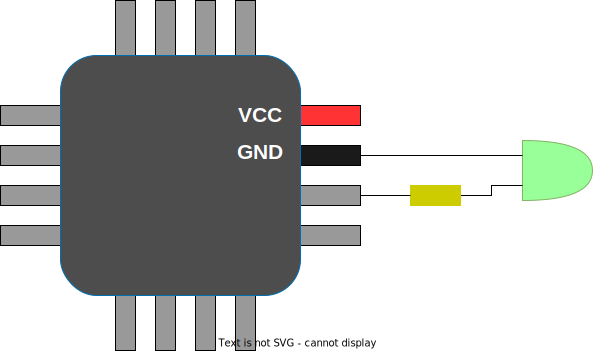

### 存储和寄存器

MCU的32位地址空间按区分割。例如，一些存储区被映射到特定的地址，这里是MCU的片内flash，固件代码指令在这些存储区读和执行。另一些区是RAM，也被映射到特定的地址，我们可以读或写任意值到RAM区。

从STM32F429数据手册的2.3.1节，我们可以了解到RAM区从地址0x20000000开始，共有192KB。从2.4节我们可以了解到flash被映射到0x08000000，共2MB，所以flash和RAM的位置像这样：


从数据手册中我们也可以看到还有很多其它存储区，它们的地址在2.3节"Memory Map"给出，例如："GPIOA"区从地址0x40020000开始，长度为1KB。

这些存储区被关联到MCU芯片内部不同的外设电路上，以特殊的方式控制外设引脚的行为。一个外设存储区是一些32位寄存器的集合，每个寄存器有4字节的空间，在特定的地址，控制着外设的特定功能。通过向寄存器写入值，或者说向特定的地址写一个32位的值，我们就可以控制外设的行为。通过读寄存器的值，我们就可以得到外设的数据或配置。

MCU通常有许多不同的外设，其中比较简单的就是GPIO（General Purpose Input Output，通用输入输出），它允许用户将MCU引脚设为输出模式，然后置“高”或置“低”；或者设置为输入模式，然后读引脚电压的“高”或“低”。还有UART外设，可以使用串行协议通过两个引脚收发数据。还有许多其它外设。

在MCU中，一个相同外设通常会有多个“实例”，比如GPIOA、GPIOB等等，它们控制着MCU引脚的不同集合。类似地，也有UART1、UART2等等，可以实现多通道。在Nucleo-F429上，有多个GPIO和UART外设。

例如，GPIOA外设起始地址为0x40020000，我们可以从数据手册8.4节找到GPIO寄存器的描述，上面说 `GPIOA_MODER` 寄存器偏移为0，意味着它的地址是 `0x40020000 + 0`，寄存器地址格式如下：

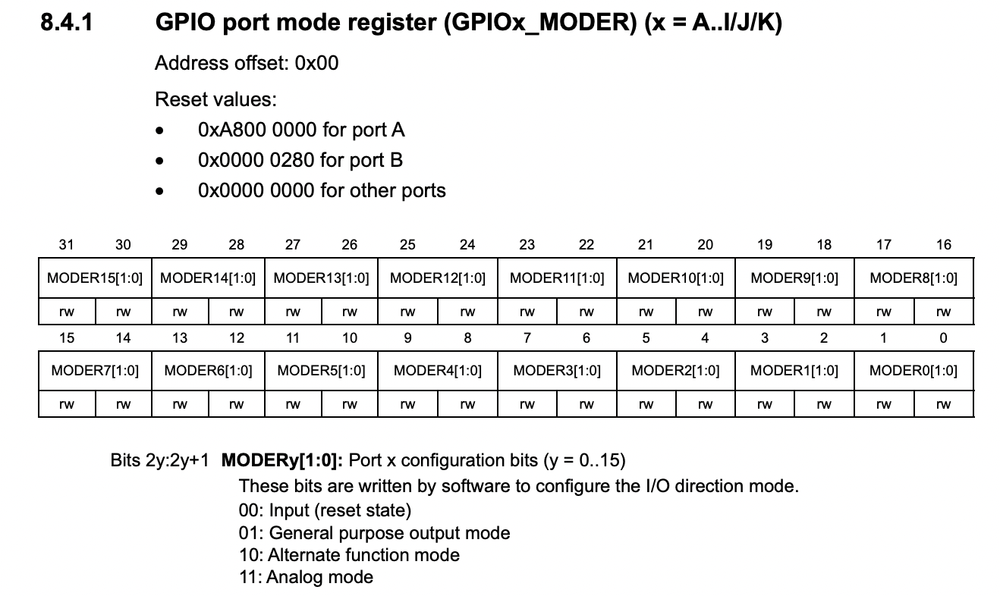

数据手册显示MODER这个32位寄存器是由16个2位的值组成。因此，一个MODER寄存器控制16个物理引脚，0-1位控制引脚0，2-3位控制引脚1，以此类推。这个2位的值编码了引脚模式：'00'代表输入，'01'代表输出，'10'代表替代功能——在其它部分进行描述，'11'代表模拟引脚。因为这个外设命名为'GPIOA'，所以对应引脚名为'A0'、'A1'，等等。对于外设'GPIOB'，引脚则对应叫'B0'、'B1'，等等。

如果我们向MODER寄存器写入32位的值'0'，就会把从A0到A15这16个引脚设为输入模式：

```c
  * (volatile uint32_t *) (0x40020000 + 0) = 0;  // Set A0-A15 to input mode
```

通过设置独立的位，我们就可以把特定的引脚设为想要的模式。例如，下面的代码将A3设为输出模式：

```c
  * (volatile uint32_t *) (0x40020000 + 0) &= ~(3 << 6);  // CLear bit range 6-7
  * (volatile uint32_t *) (0x40020000 + 0) |= 1 << 6;     // Set bit range 6-7 to 1
```

我来解释下上面的位操作。我们的目标是把控制GPIOA外设引脚3的位，也就是6-7，设为特定值，在这里是1。这个需要2步，首先，我们必须将6-7位的当前值清除，也就是清'0'，因为这两位可能已经有值；然后，我们再将6-7设为期望值。

所以，第一步，我们先把6-7位清'0'，怎么做呢？4步：

- 使一个数有连续的N位'1'
  - 1位用1：  `0b1`
  - 2位用3:   `0b11`
  - 3位用7：  `0b111`
  - 4位用15： `0b1111`
  - 以此类推，对于N位，数值应为 `2^N - 1`。对于2位，数值为 `3`，或者写为二进制 `0b00000000000000000000000000000011`
- 将数字左移位。如果我们需要设置位 X-Y，则将数字左移X位。在我们的例子中，左移6位：`(3 << 6)`，得到 `0b00000000000000000000000011000000`
- 取反：0变1，1变0：`~(3 << 6)`, 得到 `0xb11111111111111111111111100111111`
- 现在，将寄存器值与我们的数字进行逻辑"与"操作，6-7位与'0'后会变0，其它位与'1'后不变，这就是我们想要的：`REG &= ~(3 << 6)`。注意，保持其它位的值不变是重要的，我们并不想改变其它位的配置。

一般地，如果我们想将 X-Y 位清除，或者说设为0，这样做：

```c
PERIPHERAL->REGISTER &= ~(NUMBER_WITH_N_BITS << X);
```

最后，我们把那些位设为我们想要的值，则需要把想要的值左移X位，然后与寄存器当前值进行逻辑"或"运算：

```c
PERIPHERAL->REGISTER |= VALUE << X;
```

现在，你应该明白了，下面的两行代码将把GPIOA MODER寄存器的6-7位设为1，即输出模式：

```c
  * (volatile uint32_t *) (0x40020000 + 0) &= ~(3 << 6);  // CLear bit range 6-7
  * (volatile uint32_t *) (0x40020000 + 0) |= 1 << 6;     // Set bit range 6-7 to 1
```

还有一些寄存器没有被映射到MCU外设，而是被映射到了ARM CPU的配置和控制。例如，有一个"Reset and clock control"单元（RCC），在数据手册第6节有描述，这些寄存器用来配置系统时钟和一些其它的事情。

### 可读性更好的外设寄存器编程

在前一节我们已经学习到可以通过直接访问存储地址来读写外设寄存器，下面复习下将GPIO A3设为输出模式的代码：

```c
  * (volatile uint32_t *) (0x40020000 + 0) &= ~(3 << 6);  // CLear bit range 6-7
  * (volatile uint32_t *) (0x40020000 + 0) |= 1 << 6;     // Set bit range 6-7 to 1
```

这段代码有些诡秘，如果不加以注释，很难理解。我们可以把这段代码重写成更易读的形式，方法就是用一个包含32位域的结构体来表示整个外设。我们来看一下数据手册8.4节中描述的GPIO外设的寄存器，它们是MODER、OTYPER、OSPEEDR、PUPDR、IDR、ODR、BSRR、LCKR、AFR，它们的偏移量分别是0、4、8，等等，以此类推，这意味着我们可以用一个32位域的结构体来表示，然后这样定义GPIOA：

```c
struct gpio {
  volatile uint32_t MODER, OTYPER, OSPEEDR, PUPDR, IDR, ODR, BSRR, LCKR, AFR[2];
};

#define GPIOA ((struct gpio *) 0x40020000)
```

这样我们就可以定义一个设置GPIO引脚模式的函数：

```c
// Enum values are per datasheet: 0, 1, 2, 3
enum {GPIO_MODE_INPUT, GPIO_MODE_OUTPUT, GPIO_MODE_AF, GPIO_MODE_ANALOG};

static inline void gpio_set_mode(struct gpio *gpio, uint8_t pin, uint8_t mode) {
  gpio->MODER &= ~(3U << (pin * 2));        // Clear existing setting
  gpio->MODER |= (mode & 3) << (pin * 2);   // Set new mode
}
```

现在重写上面将GPIO A3设为输出模式的代码：

```c
gpio_set_mode(GPIOA, 3 /* pin */, GPIO_MODE_OUTPUT);  // Set A3 to output
```

MCU有好多个GPIO外设（也常被叫作'banks'）：A、B、C...K，在数据手册2.3节可以看到，它们映射的存储空间相隔1KB，GPIOA起始地址为0x40020000，GPIOB起始地址为0x40020400，以此类推：

```c
#define GPIO(bank) ((struct gpio *) (0x40020000 + 0x400 * (bank)))
```

我们可以给引脚进行编号，既包含组号，也包含序号。为了做到这一点，我们用一个2字节的`uint16_t`类型的数，高字节表示组号，低字节表示序号：

```c
#define PIN(bank, num) ((((bank) - 'A') << 8) | (num))
#define PINNO(pin) (pin & 255)
#define PINBANK(pin) (pin >> 8)
```

通过这种方法，我们可以指定任意GPIO引脚：

```c
  uint16_t pin1 = PIN('A', 3);    // A3   - GPIOA pin 3
  uint16_t pin2 = PIN('G', 11);   // G11  - GPIOG pin 11
```

现在，我们用这个方法再次改写`gpio_set_mode()`函数：

```c
static inline void gpio_set_mode(uint16_t pin, uint8_t mode) {
  struct gpio *gpio = GPIO(PINBANK(pin)); // GPIO bank
  uint8_t n = PINNO(pin);                 // Pin number
  gpio->MODER &= ~(3U << (n * 2));        // Clear existing setting
  gpio->MODER |= (mode & 3) << (n * 2);   // Set new mode
}
```

这样再设置GPIO A3为输出模式就很明了了：

```c
  uint16_t pin = PIN('A', 3);            // Pin A3
  gpio_set_mode(pin, GPIO_MODE_OUTPUT);  // Set to output
```

至此我们已经为GPIO外设创建了一个有用的初始化API，其它外设，比如串口，也可以用相似的方法来实现。这是一种很好的编程实践，可以让代码清晰可读。

## MCU启动和向量表

当STM32F429 MCU启动时，它会从flash存储区最前面的位置读取一个叫作“向量表”的东西。“向量表”的概念所有ARM MCU都通用，它是一个包含32位中断处理程序地址的数组。对于所有的ARM MCU，向量表前16个地址由ARM保留，其余的作为外设中断处理程序入口，由MCU厂商定义。越简单的MCU中断处理程序入口越少，越复杂的MCU中断处理程序入口则会更多。

STM32F429的向量表在数据手册表62中描述，我们可以看到它在16个ARM保留的标准中断处理程序入口外还有91个外设中断处理程序入口。

在向量表中，我们当前对前两个入口点比较感兴趣，它们在MCU启动过程中扮演了关键角色。这两个值是：初始堆栈指针和执行启动函数的地址（固件程序入口点）。

所以现在我们知道，我们必须确保固件中第2个32位值包含启动函数的地址，当MCU启动时，它会从flash读取这个地址，然后跳转到我们的启动函数。

## 最小固件

现在我们创建一个 `main.c` 文件，指定一个初始进入无限循环什么都不做的启动函数，并把包含16个标准入口和91个STM32入口的向量表放进去。用你常用的编辑器创建 `main.c` 文件，并写入下面的内容：

```c
// Startup code
__attribute__((naked, noreturn)) void _reset(void) {
  for (;;) (void) 0;  // Infinite loop
}

extern void _estack(void);  // Defined in link.ld

// 16 standard and 91 STM32-specific handlers
__attribute__((section(".vectors"))) void (*tab[16 + 91])(void) = {
  _estack, _reset
};
```

对于 `_reset()` 函数，我们使用了GCC编译器特定的 `naked` 和 `noreturn` 属性，这意味着标准函数的进入和退出不会被编译器创建，这个函数永远不会返回。

`void (*tab[16 + 91])(void)` 这个表达式的意思是：定义一个16+91个指向没有返回也没有参数的函数的指针数组，每个这样的函数都是一个中断处理程序，这个指针数组就是向量表。

我们把 `tab` 向量表放到一个独立的叫作 `.vectors` 的区段，后面需要告诉链接器把这个区段放到固件最开始的地址，也就是flash存储区最开始的地方。前2个入口分别是：堆栈指针和固件入口，目前先把向量表其它值用0填充。

### 编译

我们来编译下代码，打开终端并执行：

```sh
$ arm-none-eabi-gcc -mcpu=cortex-m4 main.c -c
```

成功了！编译器生成了 `main.o` 文件，包含了最小固件，虽然这个固件程序什么都没做。这个 `main.o` 文件是ELF二进制格式的，包含了多个区段，我们来具体看一下：

```sh
$ arm-none-eabi-objdump -h main.o
...
Sections:
Idx Name          Size      VMA       LMA       File off  Algn
  0 .text         00000002  00000000  00000000  00000034  2**1
                  CONTENTS, ALLOC, LOAD, READONLY, CODE
  1 .data         00000000  00000000  00000000  00000036  2**0
                  CONTENTS, ALLOC, LOAD, DATA
  2 .bss          00000000  00000000  00000000  00000036  2**0
                  ALLOC
  3 .vectors      000001ac  00000000  00000000  00000038  2**2
                  CONTENTS, ALLOC, LOAD, RELOC, DATA
  4 .comment      0000004a  00000000  00000000  000001e4  2**0
                  CONTENTS, READONLY
  5 .ARM.attributes 0000002e  00000000  00000000  0000022e  2**0
                  CONTENTS, READONLY
```

注意现在所有区段的 VMA/LMA 地址都是0，这表示 `main.o` 还不是一个完整的固件，因为它没有包含各个区段从哪个地址空间载入的信息。我们需要链接器从 `main.o` 生成一个完整的固件 `firmware.elf`。

`.text` 区段包含固件代码，在上面的例子中，只有一个 `_reset()` 函数，2个字节长，是跳转到自身地址的 `jump` 指令。`.data` 和 `.bss`(初始化为0的数据) 区段都是空的。我们的固件将被拷贝到偏移0x8000000的flash区，但是数据区段应该被放到RAM里，因此 `_reset()` 函数应该把 `.data` 区段拷贝到RAM，并把整个 `.bss` 区段写入0。现在 `.data` 和 `.bss` 区段是空的，我们修改下 `_reset()` 函数让它处理好这些。

为了做到这一点，我们必须知道堆栈从哪开始，也需要知道 `.data` 和 `.bss` 区段从哪开始。这些可以通过“链接脚本”指定，链接脚本是一个带有链接器指令的文件，这个文件里存有各个区段的地址空间以及对应的符号。

### 链接脚本

创建一个链接脚本文件 `link.ld`，然后把一下内容拷进去：

```
ENTRY(_reset);
MEMORY {
  flash(rx)  : ORIGIN = 0x08000000, LENGTH = 2048k
  sram(rwx) : ORIGIN = 0x20000000, LENGTH = 192k  /* remaining 64k in a separate address space */
}
_estack     = ORIGIN(sram) + LENGTH(sram);    /* stack points to end of SRAM */

SECTIONS {
  .vectors  : { KEEP(*(.vectors)) }   > flash
  .text     : { *(.text*) }           > flash
  .rodata   : { *(.rodata*) }         > flash

  .data : {
    _sdata = .;   /* .data section start */
    *(.first_data)
    *(.data SORT(.data.*))
    _edata = .;  /* .data section end */
  } > sram AT > flash
  _sidata = LOADADDR(.data);

  .bss : {
    _sbss = .;              /* .bss section start */
    *(.bss SORT(.bss.*) COMMON)
    _ebss = .;              /* .bss section end */
  } > sram

  . = ALIGN(8);
  _end = .;     /* for cmsis_gcc.h  */
}
```

下面分段解释下：

```
ENTRY(_reset);
```

这行是告诉链接器在生成的ELF文件头中 "entry point" 属性的值。没错，这跟向量表重复了，这个的目的是为像 Ozone 这样的调试器设置固件起始的断点。调试器是不知道向量表的，所以只能依赖ELF文件头。

```
MEMORY {
  flash(rx)  : ORIGIN = 0x08000000, LENGTH = 2048k
  sram(rwx) : ORIGIN = 0x20000000, LENGTH = 192k  /* remaining 64k in a separate address space */
}
```

这是告诉链接器有2个存储区空间，以及它们的起始地址和大小。

```
_estack     = ORIGIN(sram) + LENGTH(sram);    /* stack points to end of SRAM */
```

这行告诉链接器创建一个 `_estack` 符号，它的值是RAM区的最后，这也是初始化堆栈指针的值。

```
  .vectors  : { KEEP(*(.vectors)) }   > flash
  .text     : { *(.text*) }           > flash
  .rodata   : { *(.rodata*) }         > flash
```

这是告诉链接器把向量表放在flash区最前，然后是 `.text` 区段（固件代码），再然后是只读数据 `.rodata`。

```
  .data : {
    _sdata = .;   /* .data section start */
    *(.first_data)
    *(.data SORT(.data.*))
    _edata = .;  /* .data section end */
  } > sram AT > flash
  _sidata = LOADADDR(.data);
```

这是 `.data` 区段，告诉链接器创建 `_sdata` 和 `_edata` 两个符号，我们将在 `_reset()` 函数中使用它们将数据拷贝到RAM。

```
  .bss : {
    _sbss = .;              /* .bss section start */
    *(.bss SORT(.bss.*) COMMON)
    _ebss = .;              /* .bss section end */
  } > sram
```

`.bss` 区段也是一样。

### 启动代码

现在我们来更新下 `_reset` 函数，把 `.data` 区段拷贝到RAM，然后把 `.bss` 区段初始化为0，再然后调用 `main()` 函数，在 `main()` 函数有返回的情况下进入无限循环：

```c
int main(void) {
  return 0; // Do nothing so far
}

// Startup code
__attribute__((naked, noreturn)) void _reset(void) {
  // memset .bss to zero, and copy .data section to RAM region
  extern long _sbss, _ebss, _sdata, _edata, _sidata;
  for (long *dst = &_sbss; dst < &_ebss; dst++) *dst = 0;
  for (long *dst = &_sdata, *src = &_sidata; dst < &_edata;) *dst++ = *src++;

  main();             // Call main()
  for (;;) (void) 0;  // Infinite loop in the case if main() returns
}
```

下面的框图演示了 `_reset()` 如何初始化 `.data` 和 `.bss`：

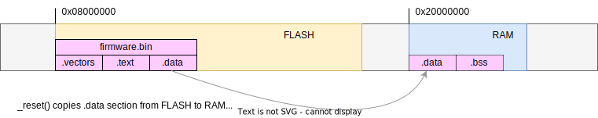

`firmware.bin` 文件由3部分组成：`.vectors`(中断向量表)、`.text`(代码)、`.data`(数据)。这些部分根据链接脚本被分配到不同的存储空间：`.vectors` 在flash的最前面，`.text` 紧随其后，`.data` 则在那之后很远的地方。`.text` 中的地址在flash区，`.data` 在RAM区。例如，一个函数的地址是 `0x8000100`，则它位于flash中。而如果代码要访问 `.data` 中的变量，比如位于 `0x20000200`，那里将什么也没有，因为在启动时 `firmware.bin` 中 `.data` 还在flash里！这就是为什么必须要在启动代码中将 `.data` 区段拷贝到RAM。

现在我们可以生成完整的 `firmware.elf` 固件了：

```sh
$ arm-none-eabi-gcc -T link.ld -nostdlib main.o -o firmware.elf
```

再次检验 `firmware.elf` 中的区段：

```sh
$ arm-none-eabi-objdump -h firmware.elf
...
Sections:
Idx Name          Size      VMA       LMA       File off  Algn
  0 .vectors      000001ac  08000000  08000000  00010000  2**2
                  CONTENTS, ALLOC, LOAD, DATA
  1 .text         00000058  080001ac  080001ac  000101ac  2**2
                  CONTENTS, ALLOC, LOAD, READONLY, CODE
...
```

可以看到，`.vectors` 区段在flash的起始地址0x8000000，`.text` 紧随其后。我们在代码中没有创建任何变量，所以没有 `.data` 区段。

## 烧写固件

现在可以把这个固件烧写到板子上了！

先把 `firmware.elf` 中各个区段抽取到一个连续二进制文件中：

```sh
$ arm-none-eabi-objcopy -O binary firmware.elf firmware.bin
```

然后使用 `st-link` 工具将 `firmware.bin` 烧入板子，连接好板子，然后执行：

```sh
$ st-flash --reset write firmware.bin 0x8000000
```

这样就把固件烧写到板子上了。

## Makefile：构建自动化

我们可以用 `make` 命令行工具替代手动敲入“编译”、“链接”、“烧写”这些命令，自动完成整个过程。`make` 工具使用一个名为 `Makefile` 的配置文件，从中读取执行动作的指令。这种自动化方式非常棒，因为这样可以把构建固件的过程、使用了哪些编译标记等也文档化。

在 https://makefiletutorial.com 上有一个非常好的给初学者的Makefile教程，强烈建议看一下。下面我将列出一些非常必要的概念以理解我们所使用的Makefile。对于已经很熟悉 `make` 的朋友，可以跳过这一部分。

其实 `Makefile` 的格式并不复杂：

```make
action1:
	command ...     # Comments can go after hash symbol
	command ....    # IMPORTANT: command must be preceded with the TAB character

action2:
	command ...     # Don't forget about TAB. Spaces won't work!
```

现在我们可以跟动作名（也被称作目标）一起调用 `make` 来执行相应的动作：

```sh
$ make action1
```

当然，也可以在命令中定义和使用变量，动作也可以是需要创建的文件名：

```make
firmware.elf:
	COMPILATION COMMAND .....
```

任何动作都可以有一个依赖列表。例如，`firmware.elf` 依赖源文件 `main.c`，当 `main.c` 改变时，`make build` 就会重新构建 `firmware.elf`:

```
build: firmware.elf

firmware.elf: main.c
	COMPILATION COMMAND
```

我们已经准备好为固件编写 `Makefile`，定义一个 `build` 动作/目标：

```make
CFLAGS  ?=  -W -Wall -Wextra -Werror -Wundef -Wshadow -Wdouble-promotion \
            -Wformat-truncation -fno-common -Wconversion \
            -g3 -Os -ffunction-sections -fdata-sections -I. \
            -mcpu=cortex-m4 -mthumb -mfloat-abi=hard -mfpu=fpv4-sp-d16 $(EXTRA_CFLAGS)
LDFLAGS ?= -Tlink.ld -nostartfiles -nostdlib --specs nano.specs -lc -lgcc -Wl,--gc-sections -Wl,-Map=$@.map
SOURCES = main.c 

build: firmware.elf

firmware.elf: $(SOURCES)
	arm-none-eabi-gcc $(SOURCES) $(CFLAGS) $(LDFLAGS) -o $@
```

在这里我们定义了一些编译标记。`?=` 表示这是默认值，我们可以在命令行中覆盖它们，像这样：

```sh
$ make build CFLAGS="-O2 ...."
```

上面的 `Makefile` 文件中定义了 `CFLAGS`、`LDFLAGS`、`SOURCES` 变量，然后我们告诉 `make` ，当要 `build` 时创建 `firmware.elf` 文件，它依赖 `main.c` 文件，使用 `arm-none-eabi-gcc` 编译器和给定的编译标记生成它。`$@` 特殊变量会被展开成动作/目标名，在这个例子中是 `firmware.elf`。

现在调用 `make` 试一下：

``` sh
$ make build
arm-none-eabi-gcc main.c  -W -Wall -Wextra -Werror -Wundef -Wshadow -Wdouble-promotion -Wformat-truncation -fno-common -Wconversion -g3 -Os -ffunction-sections -fdata-sections -I. -mcpu=cortex-m4 -mthumb -mfloat-abi=hard -mfpu=fpv4-sp-d16  -Tlink.ld -nostartfiles -nostdlib --specs nano.specs -lc -lgcc -Wl,--gc-sections -Wl,-Map=firmware.elf.map -o firmware.elf
```

如果我们再次运行：

```sh
$ make build
make: Nothing to be done for `build'.
```

`make` 会检查 `firmware.elf` 和依赖项 `main.c` 的修改时间，如果是它们是最新的，则什么都不做。如果我们修改下 `main.c`，则会重新构建：

```sh
$ touch main.c # Simulate changes in main.c
$ make build
```

现在，还剩下“烧写”这个动作/目标：

```make
firmware.bin: firmware.elf
	arm-none-eabi-objcopy -O binary $< $@

flash: firmware.bin
	st-flash --reset write $(TARGET).bin 0x8000000
```

OK，现在从终端中执行命令 `make flash` 就会创建 `firmware.bin` 文件，然后通过 `st-link` 烧入板子。当 `main.c` 改变时，这个命令也会重新构建，因为 `firmware.bin` 依赖 `firmware.elf`，`firmware.elf` 又依赖 `main.c`。所以我们的开发循环就是这样的两步：

```sh
# Develop code in main.c
$ make flash
```

还有一个良好实践就是在 `Makefile` 中添加 `clean` 动作，以删除构建生成的文件：

```
clean:
	rm -rf firmware.*
```

完整工程代码可以在 [step-0-minimal](step-0-minimal) 文件夹找到。

## 闪烁LED

现在我们已经搭建好了完整的构建、烧写的基础设施，是时候让固件做点儿有用的事情了。什么是有用的事情？当然是闪烁LED了！Nucleo-F429ZI开发板有3颗LED，在开发板数据手册的6.5节，我们可以看到板载LED连接的引脚：

- PB0: green LED
- PB7: blue LED
- PB14: red LED

再次修改 `main.c` 文件，添加上引脚定义，然后把蓝色LED引脚设为输出模式，开始无限循环。首先，把我们之前讨论过的GPIO定义和模式设置拷贝过来，注意，现在又新加了一个 `BIT(position)` 工具宏：

```c
#include <inttypes.h>
#include <stdbool.h>

#define BIT(x) (1UL << (x))
#define PIN(bank, num) ((((bank) - 'A') << 8) | (num))
#define PINNO(pin) (pin & 255)
#define PINBANK(pin) (pin >> 8)

struct gpio {
  volatile uint32_t MODER, OTYPER, OSPEEDR, PUPDR, IDR, ODR, BSRR, LCKR, AFR[2];
};
#define GPIO(bank) ((struct gpio *) (0x40020000 + 0x400 * (bank)))

// Enum values are per datasheet: 0, 1, 2, 3
enum { GPIO_MODE_INPUT, GPIO_MODE_OUTPUT, GPIO_MODE_AF, GPIO_MODE_ANALOG };

static inline void gpio_set_mode(uint16_t pin, uint8_t mode) {
  struct gpio *gpio = GPIO(PINBANK(pin));  // GPIO bank
  int n = PINNO(pin);                      // Pin number
  gpio->MODER &= ~(3U << (n * 2));         // Clear existing setting
  gpio->MODER |= (mode & 3) << (n * 2);    // Set new mode
}
```

某些微控制器在上电时会把所有外设都自动使能，然而，STM32微控制器在上电时外设是默认关闭的，以降低功耗。为了使能GPIO外设，我们需要通过RCC单元使能外设时钟。在芯片数据手册7.3.10节，可以找到AHB1ENR寄存器与此相关，还是先定义整个RCC单元：

```c
struct rcc {
  volatile uint32_t CR, PLLCFGR, CFGR, CIR, AHB1RSTR, AHB2RSTR, AHB3RSTR,
      RESERVED0, APB1RSTR, APB2RSTR, RESERVED1[2], AHB1ENR, AHB2ENR, AHB3ENR,
      RESERVED2, APB1ENR, APB2ENR, RESERVED3[2], AHB1LPENR, AHB2LPENR,
      AHB3LPENR, RESERVED4, APB1LPENR, APB2LPENR, RESERVED5[2], BDCR, CSR,
      RESERVED6[2], SSCGR, PLLI2SCFGR;
};
#define RCC ((struct rcc *) 0x40023800)
```

在AHB1ENR寄存器文档中可以看到0-8位控制GPIOA - GPIOI的时钟：

```c
int main(void) {
  uint16_t led = PIN('B', 7);            // Blue LED
  RCC->AHB1ENR |= BIT(PINBANK(led));     // Enable GPIO clock for LED
  gpio_set_mode(led, GPIO_MODE_OUTPUT);  // Set blue LED to output mode
  for (;;) asm volatile("nop");          // Infinite loop
  return 0;
}
```

接下来需要做的就是找到如何开关GPIO引脚，然后在主循环中点亮LED，延时，熄灭LED，延时。在芯片数据手册8.4.7节，可以看到BSRR寄存器与设置电压高低有关，低16位设置ODR寄存器输出高，高16位设置ODR寄存器输出低。为此定义一个API函数：

```c
static inline void gpio_write(uint16_t pin, bool val) {
  struct gpio *gpio = GPIO(PINBANK(pin));
  gpio->BSRR = (1U << PINNO(pin)) << (val ? 0 : 16);
}
```

下一步我们需要实现一个延时函数，目前还不需要精确延时，所以定义一个 `spin()` 函数，执行NOP指令给定的次数：

```c
static inline void spin(volatile uint32_t count) {
  while (count--) asm("nop");
}
```

最后，修改主循环来让LED闪烁起来：

```c
  for (;;) {
    gpio_write(pin, true);
    spin(999999);
    gpio_write(pin, false);
    spin(999999);
  }
```

执行 `make flash` 来看蓝色LED闪烁吧！

完整工程源码可以在 [step-1-blinky](step-1-blinky) 文件夹找到。

## 用SysTick中断实现闪烁

为了实现精确的时间控制，我们应该使能ARM的SysTick中断。SysTick是一个24位的硬件计数器，是ARM核的一部分，因为在ARM的数据手册中有它的文档。从芯片数据手册中可以看到，SysTick有4个寄存器：

- CTRL，使能/禁能SysTick
- LOAD，初始计数值
- VAL，当前计数值，每个时钟周期递减
- CALIB，校准寄存器

每次VAL减到0，就会产生一个SysTick中断，SysTick中断在向量表中的索引为15，我们需要设置它。在启动时，Nucleo-F429ZI的时钟是16MHz，我们可以配置SysTick计数器使其每毫秒产生一个中断。

首先，定义SysTick外设，我们知道有4个寄存器，并且从芯片数据手册中可以知道SysTick地址为0xe000e010，编写代码：

```c
struct systick {
  volatile uint32_t CTRL, LOAD, VAL, CALIB;
};
#define SYSTICK ((struct systick *) 0xe000e010)
```

接下来定义一个API函数配置SysTick，我们需要在 `SYSTICK->CTRL` 寄存器使能SysTick，同时也需要在 `RCC->APB2ENR` 中使能它的时钟，这一点在芯片数据手册7.4.14节描述：

```c
#define BIT(x) (1UL << (x))
static inline void systick_init(uint32_t ticks) {
  if ((ticks - 1) > 0xffffff) return;  // Systick timer is 24 bit
  SYSTICK->LOAD = ticks - 1;
  SYSTICK->VAL = 0;
  SYSTICK->CTRL = BIT(0) | BIT(1) | BIT(2);  // Enable systick
  RCC->APB2ENR |= BIT(14);                   // Enable SYSCFG
}
```

默认情况下，Nucleo-F429ZI运行频率为16MHz，这表示如果我们调用 `systick_init(16000000 / 1000)`，就会每毫秒产生一个SysTick中断。还需要定义一个中断处理函数，现在只是在中断处理函数中递增一个32位数：

```c
static volatile uint32_t s_ticks; // volatile is important!!
void SysTick_Handler(void) {
  s_ticks++;
}
```

注意 `s_ticks` 要用 `volatile` 说明符，在中断处理函数中的任何变量都应该标记为 `volatile`，这样可以避免编译器通过在寄存器中缓存变量值的优化操作。`volatile` 关键字可以是生成的代码总是从存储空间载入变量值。

现在把SysTick中断处理函数加到向量表中：

```c
__attribute__((section(".vectors"))) void (*tab[16 + 91])(void) = {
    0, _reset, 0, 0, 0, 0, 0, 0, 0, 0, 0, 0, 0, 0, 0, SysTick_Handler};
```

这样我们就有精确的毫秒时钟了！再创建一个任意周期的定时器工具函数：

```c
// t: expiration time, prd: period, now: current time. Return true if expired
bool timer_expired(uint32_t *t, uint64_t prd, uint64_t now) {
  if (now + prd < *t) *t = 0;                    // Time wrapped? Reset timer
  if (*t == 0) *t = now + prd;                   // First poll? Set expiration
  if (*t > now) return false;                    // Not expired yet, return
  *t = (now - *t) > prd ? now + prd : *t + prd;  // Next expiration time
  return true;                                   // Expired, return true
}
```

使用这个精确的定时器函数更新闪烁LED的主循环，例如，每500ms闪烁一次：

```c
  uint32_t timer = 0, period = 500;       // Declare timer and 500ms period
  for (;;) {
    if (timer_expired(&timer, period, s_ticks)) {
      static bool on;       // This block is executed
      gpio_write(led, on);  // Every `period` milliseconds
      on = !on;             // Toggle LED state
    }
    // Here we could perform other activities!
  }
```

通过使用 `SysTick` 和 `timer_expired()` 工具函数，使主循环成为非阻塞的。这意味着在主循环中我们还可以执行许多动作，例如，创建不同周期的定时器，它们都能及时被触发。

完整工程源码可以在 [step-2-systick](step-2-systick) 文件夹找到。

## 添加串口调试输出

现在是时候给固件添加一些人类可读的诊断信息了。MCU外设中有一个串行通信接口，通常被称作串口。看一下芯片数据手册2.3节，STM32F429有多个串口控制器，适当配置后就可以通过特定引脚与外部交换数据。最小化的串口配置需要2个引脚，一个接收，另一个发送。

在Nucleo开发板数据手册6.9节，可以看到MCU的串口3的发送引脚是PD8，接收引脚是PD9，并且已经被连到了板载的ST-LINK调试器上，这意味着我们配置好串口3就可以通过PD8发送数据，然后通过ST-LINK在工作站上看到MCU发送的数据。

现在给串口创建API，就像之前GPIO那样。芯片数据手册30.6节概括了串口寄存器，可以这样定义串口结构体：

```c
struct uart {
  volatile uint32_t SR, DR, BRR, CR1, CR2, CR3, GTPR;
};
#define UART1 ((struct uart *) 0x40011000)
#define UART2 ((struct uart *) 0x40004400)
#define UART3 ((struct uart *) 0x40004800)
```

要配置串口，需要这些步骤：

- 使能串口时钟，通过设置 `RCC->APB2ENR` 寄存器的相应位
- 设置接收和发送引脚为替代功能，替代功能列表在芯片数据手册表12
- 设置波特率（通信速率），通过 `BRR` 寄存器
- 使能串口外设，通过 `CR1` 寄存器接收和发送数据

我们已经知道如何把GPIO引脚设为特定的模式，如果1个引脚被用作替代功能，我们也必须指定替代功能编号，可以通过GPIO外设的替代功能寄存器 `AFR` 进行控制。仔细阅读芯片数据手册中对 `AFR` 寄存器的描述，可以发现替代功能有4位编号，所以要控制全部16个引脚需要2个32位寄存器。设置引脚替代功能的API可以这样实现：

```c
static inline void gpio_set_af(uint16_t pin, uint8_t af_num) {
  struct gpio *gpio = GPIO(PINBANK(pin));  // GPIO bank
  int n = PINNO(pin);                      // Pin number
  gpio->AFR[n >> 3] &= ~(15UL << ((n & 7) * 4));
  gpio->AFR[n >> 3] |= ((uint32_t) af_num) << ((n & 7) * 4);
}
```

为了从GPIO API中完全隐藏寄存器特定的代码，我们把GPIO时钟初始化的代码移动到 `gpio_set_mode()` 函数中：

```c
static inline void gpio_set_mode(uint16_t pin, uint8_t mode) {
  struct gpio *gpio = GPIO(PINBANK(pin));  // GPIO bank
  int n = PINNO(pin);                      // Pin number
  RCC->AHB1ENR |= BIT(PINBANK(pin));       // Enable GPIO clock
  ...
```

现在可以创建一个串口初始化的API函数：

```c
#define FREQ 16000000  // CPU frequency, 16 Mhz
static inline void uart_init(struct uart *uart, unsigned long baud) {
  // https://www.st.com/resource/en/datasheet/stm32f429zi.pdf
  uint8_t af = 7;           // Alternate function
  uint16_t rx = 0, tx = 0;  // pins

  if (uart == UART1) RCC->APB2ENR |= BIT(4);
  if (uart == UART2) RCC->APB1ENR |= BIT(17);
  if (uart == UART3) RCC->APB1ENR |= BIT(18);

  if (uart == UART1) tx = PIN('A', 9), rx = PIN('A', 10);
  if (uart == UART2) tx = PIN('A', 2), rx = PIN('A', 3);
  if (uart == UART3) tx = PIN('D', 8), rx = PIN('D', 9);

  gpio_set_mode(tx, GPIO_MODE_AF);
  gpio_set_af(tx, af);
  gpio_set_mode(rx, GPIO_MODE_AF);
  gpio_set_af(rx, af);
  uart->CR1 = 0;                           // Disable this UART
  uart->BRR = FREQ / baud;                 // FREQ is a UART bus frequency
  uart->CR1 |= BIT(13) | BIT(2) | BIT(3);  // Set UE, RE, TE
}
```

最后，再来实现串口读写函数。芯片数据手册30.6.1节告诉我们状态寄存器 `SR` 表示数据是否准备好：

```c
static inline int uart_read_ready(struct uart *uart) {
  return uart->SR & BIT(5);  // If RXNE bit is set, data is ready
}
```

数据可以从数据寄存器 `DR` 中获取：

```c
static inline uint8_t uart_read_byte(struct uart *uart) {
  return (uint8_t) (uart->DR & 255);
}
```

发送单个字节的数据也是通过 `DR` 寄存器完成。设置好要发送的数据后，我们需要等待发送完成，通过检查 `SR` 寄存器第7位来实现：

```c
static inline void uart_write_byte(struct uart *uart, uint8_t byte) {
  uart->DR = byte;
  while ((uart->SR & BIT(7)) == 0) spin(1);
}
```

写数据到缓冲区：

```c
static inline void uart_write_buf(struct uart *uart, char *buf, size_t len) {
  while (len-- > 0) uart_write_byte(uart, *(uint8_t *) buf++);
}
```

在 `main()` 函数中初始化串口：

```c
  ...
  uart_init(UART3, 115200);              // Initialise UART
```

然后每次闪烁LED时输出一条消息 "hi\r\n"：

```c
    if (timer_expired(&timer, period, s_ticks)) {
      ...
      uart_write_buf(UART3, "hi\r\n", 4);  // Write message
    }
```

重新编译，然后烧写到开发板上，用一个终端程序连接ST-LINK的端口。在Mac上，我用 `cu`，在Linux上也可以用它。在Windows上使用 `putty` 工具是一个好主意。打开终端，执行命令后可以看到：

```sh
$ cu -l /dev/cu.YOUR_SERIAL_PORT -s 115200
hi
hi
```

完整工程代码可以在 [step-3-uart](step-3-uart) 文件夹找到。

## 重定向`printf()`到串口

在这一节，我们将 `uart_write_buf()` 调用替换为 `printf()`，它使我们能够进行格式化输出，这样可以更好的输出诊断信息，实现了“打印样式的调试”。

我们使用的GNU ARM工具链除了包含GCC编译器和一些工具外，还包含了一个被称为[newlib](https://sourceware.org/newlib)的C库，由红帽为嵌入式系统开发。

如果我们的固件调用了一个标准C库函数，比如 `strcmp()`，newlib就会被GCC链接器加到我们的固件中。

newlib实现了一些标准C函数，特别是文件输入输出操作，并且被实现的很随潮流：这些函数最终调用一组被称为 "syscalls" 的底层输入输出函数。

例如：

- `fopen()` 最终调用 `_open()`
- `fread()` 最终调用 `_read()`
- `fwrite()`, `fprintf()`, `printf()` 最终调用 `_write()`
- `malloc` 最终调用 `_sbrk()`，等等

因此，通过修改 `_write()` 系统调用，我们可以重定向 `printf()` 到任何我们希望的地方，这个机制被称为 "IO retargeting"。

注意，STM32 Cube也使用ARM GCC工具链，这就是为什么Cube工程都包含 `syscalls.c` 文件。其它工具链，比如TI的CCS、Keil的CC，可能使用不同的C库，重定向机制会有一点区别。我们用newlib，所以修改 `_write()` 可以打印到串口3。

在那之前，我们先重新组织下源码结构：

- 把所有API定义放到 `hal.h` 文件中
- 把启动代码放到 `startup.c` 文件中
- 为newlib的系统调用创建一个空文件 `syscalls.c`
- 修改Makefile，把 `syscalls.c` 和 `startup.c` 加到build中

将所有 API 定义移动到 `hal.h` 后，`main.c` 文件变得相当紧凑。注意我们还没提到底层寄存器，高级API函数很容易理解：

```c
#include "hal.h"

static volatile uint32_t s_ticks;
void SysTick_Handler(void) {
  s_ticks++;
}

int main(void) {
  uint16_t led = PIN('B', 7);            // Blue LED
  systick_init(16000000 / 1000);         // Tick every 1 ms
  gpio_set_mode(led, GPIO_MODE_OUTPUT);  // Set blue LED to output mode
  uart_init(UART3, 115200);              // Initialise UART
  uint32_t timer = 0, period = 500;      // Declare timer and 500ms period
  for (;;) {
    if (timer_expired(&timer, period, s_ticks)) {
      static bool on;                      // This block is executed
      gpio_write(led, on);                 // Every `period` milliseconds
      on = !on;                            // Toggle LED state
      uart_write_buf(UART3, "hi\r\n", 4);  // Write message
    }
    // Here we could perform other activities!
  }
  return 0;
}
```

现在我们把 `printf()` 重定向到串口3，在空的 `syscalls.c` 文件中拷入一下内容：

```c
#include "hal.h"

int _write(int fd, char *ptr, int len) {
  (void) fd, (void) ptr, (void) len;
  if (fd == 1) uart_write_buf(UART3, ptr, (size_t) len);
  return -1;
}
```

这段代码：如果我们写入的文件描述符是 1（这是一个标准输出描述符），则将缓冲区写入串口3，否则忽视。这就是重定向的本质！

重新编译，会得到一些链接器错误：

```sh
../../arm-none-eabi/lib/thumb/v7e-m+fp/hard/libc_nano.a(lib_a-sbrkr.o): in function `_sbrk_r':
sbrkr.c:(.text._sbrk_r+0xc): undefined reference to `_sbrk'
closer.c:(.text._close_r+0xc): undefined reference to `_close'
lseekr.c:(.text._lseek_r+0x10): undefined reference to `_lseek'
readr.c:(.text._read_r+0x10): undefined reference to `_read'
fstatr.c:(.text._fstat_r+0xe): undefined reference to `_fstat'
isattyr.c:(.text._isatty_r+0xc): undefined reference to `_isatty'
```

这是因为我们使用了newlib的标准输入输出函数，那么就需要把newlib中其它的系统调用也实现。除了_sbrk之外我们可以加入一些简单的什么都不做的桩函数。而_sbrk会在printf()函数中使用malloc()的时候被调用到，所以它需要被实现：

```c
int _fstat(int fd, struct stat *st) {
  (void) fd, (void) st;
  return -1;
}

void *_sbrk(int incr) {
  extern char _end;
  static unsigned char *heap = NULL;
  unsigned char *prev_heap;
  if (heap == NULL) heap = (unsigned char *) &_end;
  prev_heap = heap;
  heap += incr;
  return prev_heap;
}

int _close(int fd) {
  (void) fd;
  return -1;
}

int _isatty(int fd) {
  (void) fd;
  return 1;
}

int _read(int fd, char *ptr, int len) {
  (void) fd, (void) ptr, (void) len;
  return -1;
}

int _lseek(int fd, int ptr, int dir) {
  (void) fd, (void) ptr, (void) dir;
  return 0;
}
```

再重新编译，应该就不会报错了。

最后一步，将 `main()` 中 `uart_write_buf()` 替换为 `printf()`，并打印一些有用的信息，比如LED状态和当前s_ticks的值：

```c
printf("LED: %d, tick: %lu\r\n", on, s_ticks);  // Write message
```

再重新编译，串口输出应该像这样：

```sh
LED: 1, tick: 250
LED: 0, tick: 500
LED: 1, tick: 750
LED: 0, tick: 1000
```

可喜可贺！我们学习了IO重定向是如何工作的，并且可以用打印输出来调试固件了。

完整工程源码可以在 [step-4-printf](step-4-printf) 文件夹找到。

## 用Segger Ozone进行调试

如果我们的固件卡在某个地方并且 printf 调试不起作用怎么办？甚至连启动代码都不起作用怎么办？我们需要一个调试器。那有很多选项，但我建议使用Segger的Ozone调试器。为什么？因为它是独立的，不依赖任何IDE。我们可以把 `firmware.elf` 直接提供给Ozone，它会自动拾取源文件。

可以从Segger网站[下载 Ozone](https://www.segger.com/products/development-tools/ozone-j-link-debugger/)。在用它调试我们的Nucleo开发板之前，我们需要把板载的ST-LINK固件改成jlink的固件，这样Ozone才能识别。遵循Segger网站的[说明](https://www.segger.com/products/debug-probes/j-link/models/other-j-links/st-link-on-board/)完成固件修改。

现在，运行Ozone，在向导中选择设备：

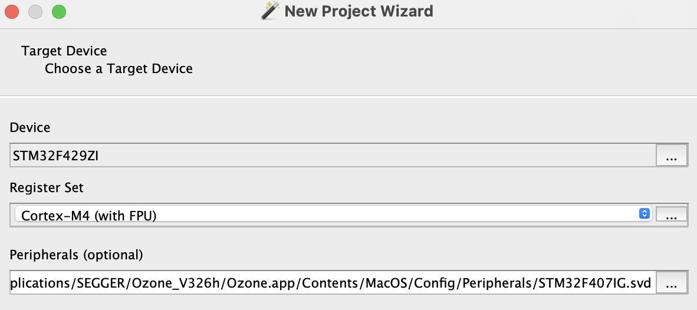

选择我们要用的调试器硬件：

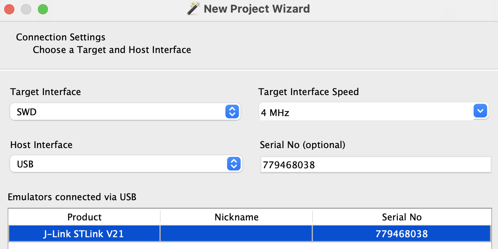

然后选择 `firmware.elf` 固件文件：

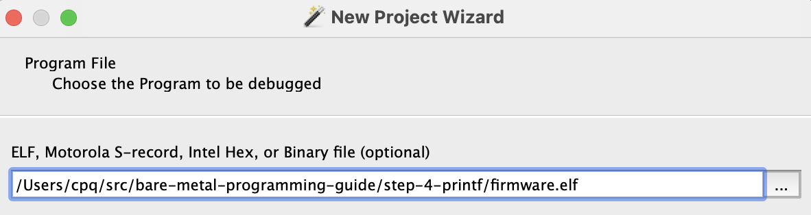

接下来的步骤保持默认，点击“完成”，调试器已经载入（可以看到`hal.h`源码被拾取）：


点击左上角的绿色按钮，下载、运行固件，然后会停在这里：

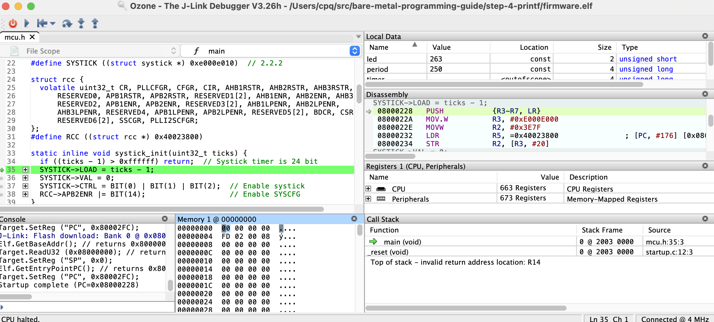

现在我们可以单步运行代码，设置断点，以及其它调试工作。有一个地方可以注意，那就是Ozone方便的外设视图：

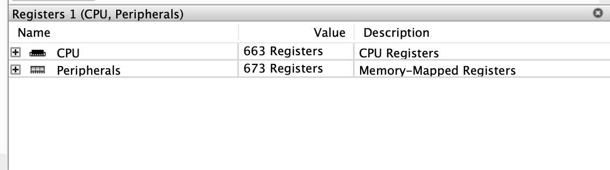

我们可以用它直接检查或设置外设的状态，例如，点亮板子上的绿色LED（PB0）：

1. 先使能GPIOB时钟，找到  Peripherals -> RCC -> AHB1ENR，然后把 GPIOBEN 位设为1：
  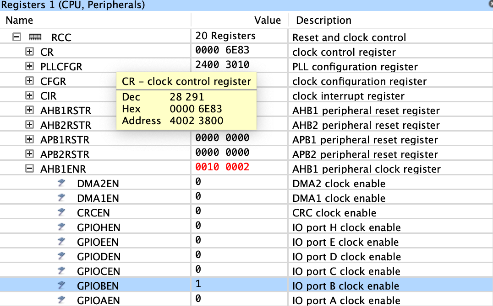

2. 找到 Peripherals -> GPIO -> GPIOB -> MODER，设置 MODER0 为1（输出）：
  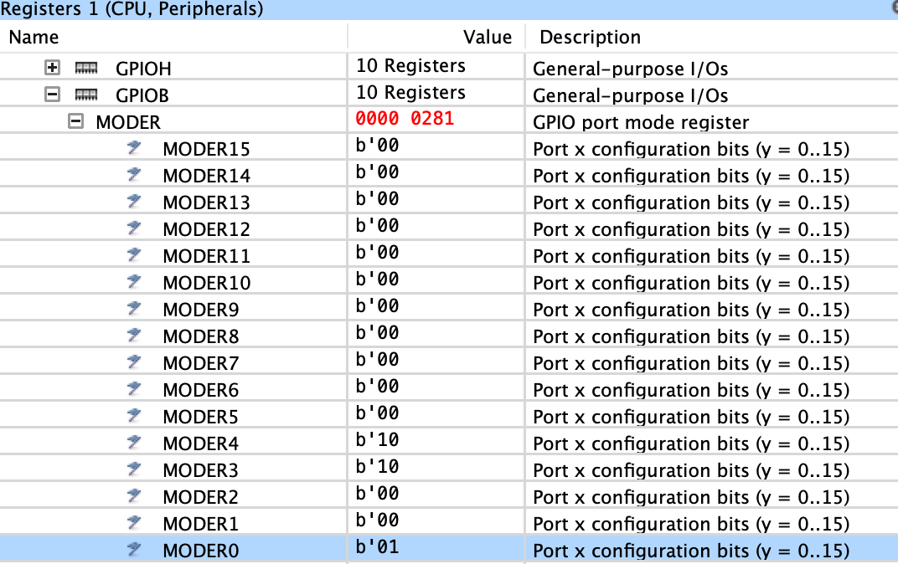

3. 找到 Peripherals -> GPIO -> GPIOB -> ODR，设置 ODR0 为1（高电平）：
  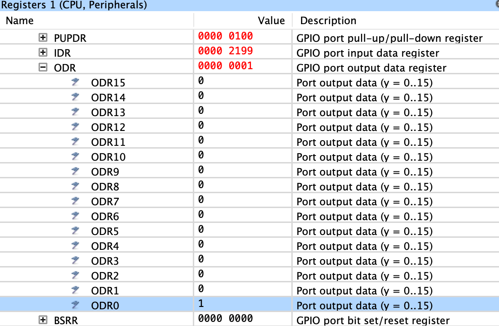

这样绿色LED就被点亮了。愉快地调试吧！

## 供应商CMSIS头文件

在前面的部分，我们仅使用数据手册、编辑器和GCC编译器开发了固件程序，使用数据手册创建了外设结构定义。

现在我们已经知道MCU是怎么工作的，是时候介绍一下CMSIS头文件了。它是什么？它是由MCU厂商创建和提供的带有全部定义的头文件。它包含MCU相关的全部，所以很庞大。

CMSIS代表通用微控制器软件接口标准（Common Microcontroller Software Interface Standard），因此它是MCU制造商指定外设API的共同基础。 因为CMSIS是一种ARM标准，并且CMSIS头文件由MCU厂商提供，所以是权威的来源。因此，使用供应商头文件是首选方法，而不是手动编写定义。

在这一节，我们将使用供应商CMSIS头文件替换 `hal.h` 中的API函数，并保持固件其它部分不变。

STM32 F4系列的CMSIS头文件在这个[仓库](https://github.com/STMicroelectronics/cmsis_device_f4)，从那里将以下文件拷到我们的固件文件夹[step-5-cmsis](step-5-cmsis)：

- [stm32f429xx.h](https://raw.githubusercontent.com/STMicroelectronics/cmsis_device_f4/master/Include/stm32f429xx.h)
- [system_stm32f4xx.h](https://raw.githubusercontent.com/STMicroelectronics/cmsis_device_f4/master/Include/system_stm32f4xx.h)

Those two files depend on a standard ARM CMSIS includes, download them too:
- [core_cm4.h](https://raw.githubusercontent.com/STMicroelectronics/STM32CubeF4/master/Drivers/CMSIS/Core/Include/core_cm4.h)
- [cmsis_gcc.h](https://raw.githubusercontent.com/STMicroelectronics/STM32CubeF4/master/Drivers/CMSIS/Core/Include/cmsis_gcc.h)
- [cmsis_version.h](https://raw.githubusercontent.com/STMicroelectronics/STM32CubeF4/master/Drivers/CMSIS/Core/Include/cmsis_version.h)
- [cmsis_compiler.h](https://raw.githubusercontent.com/STMicroelectronics/STM32CubeF4/master/Drivers/CMSIS/Core/Include/cmsis_compiler.h)
- [mpu_armv7.h](https://raw.githubusercontent.com/STMicroelectronics/STM32CubeF4/master/Drivers/CMSIS/Core/Include/mpu_armv7.h)

然后移除 `hal.h` 中所有外设API和定义，只留下标准C包含、供应商CMSIS包含，引脚定义等：

```c
#pragma once

#include <inttypes.h>
#include <stdbool.h>
#include <stdlib.h>
#include <stdio.h>
#include <sys/stat.h>

#include "stm32f429xx.h"

#define FREQ 16000000  // CPU frequency, 16 Mhz
#define BIT(x) (1UL << (x))
#define PIN(bank, num) ((((bank) - 'A') << 8) | (num))
#define PINNO(pin) (pin & 255)
#define PINBANK(pin) (pin >> 8)

static inline void spin(volatile uint32_t count) {
  while (count--) asm("nop");
}

static inline bool timer_expired(uint32_t *t, uint32_t prd, uint32_t now) {
  ...
}
```

如果我们执行 `make clean build` 重新编译固件，GCC会报错：缺少 `systick_init()`, `GPIO_MODE_OUTPUT`, `uart_init()`,
和 `UART3`。我们使用STM32 CMSIS文件重新添加它们。

从 `systick_init()` 开始， `core_cm4.h` 头文件中定义了 `SysTick_Type` 结构体，与我们的 `struct systick` 和 `SysTick` 外设相关宏定义作用相同。还有，`stm32f429xx.h` 头文件中有一个 `RCC_TypeDef` 结构体与我们的 `RCC` 宏定义一样，所以我们的 `systick_init()` 函数几乎不用修改，只需要用 `SYSTICK` 替换 `SysTick`：

```c
static inline void systick_init(uint32_t ticks) {
  if ((ticks - 1) > 0xffffff) return;  // Systick timer is 24 bit
  SysTick->LOAD = ticks - 1;
  SysTick->VAL = 0;
  SysTick->CTRL = BIT(0) | BIT(1) | BIT(2);  // Enable systick
  RCC->APB2ENR |= BIT(14);                   // Enable SYSCFG
}
```

接下来是 `gpio_set_mode()` 函数。`stm32f429xx.h` 头文件中有一个 `GPIO_TypeDef` 结构体，与我们的 `struct gpio` 相同，使用它改写：

```c
#define GPIO(bank) ((GPIO_TypeDef *) (GPIOA_BASE + 0x400 * (bank)))
enum { GPIO_MODE_INPUT, GPIO_MODE_OUTPUT, GPIO_MODE_AF, GPIO_MODE_ANALOG };

static inline void gpio_set_mode(uint16_t pin, uint8_t mode) {
  GPIO_TypeDef *gpio = GPIO(PINBANK(pin));  // GPIO bank
  int n = PINNO(pin);                      // Pin number
  RCC->AHB1ENR |= BIT(PINBANK(pin));       // Enable GPIO clock
  gpio->MODER &= ~(3U << (n * 2));         // Clear existing setting
  gpio->MODER |= (mode & 3) << (n * 2);    // Set new mode
}
```

`gpio_set_af()` 和 `gpio_write()` 也是一样简单替换就行。

然后是串口，CMSIS中有 `USART_TypeDef` 和 `USART1`、`USART2`、`USART3` 的定义，使用它们：

```c
#define UART1 USART1
#define UART2 USART2
#define UART3 USART3
```

在 `uart_init()` 以及其它串口函数中将 `struct uart` 替换为 `USART_TypeDef`，其余部分保持不变。

做完这些，重新编译和烧写固件。LED又闪烁起来，串口也有输出了。恭喜！

我们已经使用供应商CMSIS头文件重写了固件代码，现在重新组织下代码，把所有标准文件放到 `include` 目录下，然后更新Makefile文件让GCC编译器知道：

```make
...
  -g3 -Os -ffunction-sections -fdata-sections -I. -Iinclude \
```

现在得到了一个可以在未来的工程中重用的工程模板。

完整工程源码可以在 [step-5-cmsis](step-5-cmsis) 文件夹找到。

## 配置时钟

启动后，Nucleo-F429ZI CPU以16MHz运行，最大频率为180MHz。请注意，系统时钟频率并不是我们需要关心的唯一因素。外设连接到不同的总线，APB1 和 APB2 时钟不同。 它们的时钟速度由频率预分频器配置值，在 RCC 中设置。主 CPU 时钟源也可以不同 - 我们可以使用外部晶体振荡器 （HSE） 或内部振荡器（HSI）。在我们的例子中，我们将使用 HSI。

当CPU从闪存执行指令时，闪存读取速度（大约25MHz）在CPU时钟变高时成为瓶颈。有几个技巧会有所帮助，指令预取就是其中之一。此外，我们可以给闪存控制器提供一些线索，告诉它系统时钟有多快：该值称为闪存延迟。对于 180MHz 系统时钟，`FLASH_LATENCY`值为 5。闪存控制器中的位 8 和 9 控制启用指令和数据缓存：

```c
  FLASH->ACR |= FLASH_LATENCY | BIT(8) | BIT(9);      // Flash latency, caches
```

时钟源（HSI 或 HSE）通过一个称为锁相环（PLL）的硬件，将源频率乘以特定值。然后，一组分频器用于设置系统时钟和APB1、APB2时钟。为了获得180MHz的最大系统时钟，可能需要多个值的PLL分频器和APB预分频器。第 6.3.3 节数据表告诉我们APB1时钟的最大值：<= 45MHz，和 APB2 时钟：<= 90MHz。这缩小了可能的列表组合。在这里，我们手动选择值。请注意，像CubeMX这样的工具可以自动化该过程，并使其变得简单和可视化。

```c
enum { APB1_PRE = 5 /* AHB clock / 4 */, APB2_PRE = 4 /* AHB clock / 2 */ };
enum { PLL_HSI = 16, PLL_M = 8, PLL_N = 180, PLL_P = 2 };  // Run at 180 Mhz
#define PLL_FREQ (PLL_HSI * PLL_N / PLL_M / PLL_P)
#define FREQ (PLL_FREQ * 1000000)
```

现在，我们已经准备好使用简单的算法来设置CPU和外设总线的时钟。可能看起来像这样：

- 可选，使能FPU
- 设置flash延迟
- 确定时钟源，PLL、APB1和APB2分频
- 配置RCC

```c
static inline void clock_init(void) {                 // Set clock frequency
  SCB->CPACR |= ((3UL << 10 * 2) | (3UL << 11 * 2));  // Enable FPU
  FLASH->ACR |= FLASH_LATENCY | BIT(8) | BIT(9);      // Flash latency, caches
  RCC->PLLCFGR &= ~((BIT(17) - 1));                   // Clear PLL multipliers
  RCC->PLLCFGR |= (((PLL_P - 2) / 2) & 3) << 16;      // Set PLL_P
  RCC->PLLCFGR |= PLL_M | (PLL_N << 6);               // Set PLL_M and PLL_N
  RCC->CR |= BIT(24);                                 // Enable PLL
  while ((RCC->CR & BIT(25)) == 0) spin(1);           // Wait until done
  RCC->CFGR = (APB1_PRE << 10) | (APB2_PRE << 13);    // Set prescalers
  RCC->CFGR |= 2;                                     // Set clock source to PLL
  while ((RCC->CFGR & 12) == 0) spin(1);              // Wait until done
}
```

剩下的就是从主函数调用 `clock_init`，然后重新编译和烧写，这样我们的板子就以它的最大速度180MHz运行了！

完整工程源码可以在 [step-6-clock](step-6-clock) 文件夹找到。

## 带设备仪表盘的网络服务器

Nucleo-F429ZI 带有板载以太网。以太网硬件需要两个组件：PHY（向铜缆、光缆等介质发送和接收电信号）和 MAC（驱动 PHY 控制器）。
在我们的Nucleo开发板上，MAC控制器是MCU内置的，PHY是外部的（具体来说，是Microchip的LAN8720a）。

MAC和PHY可以用多个接口通信，我们将使用RMII。为此，一些引脚必须配置为使用其替代功能 （AF）。要实现 Web 服务器，我们需要 3 个软件组件：
- 网络驱动程序，用于向 MAC 控制器发送/接收以太网帧
- 一个网络堆栈，用于解析帧并理解 TCP/IP
- 理解HTTP的网络库

我们将使用[猫鼬网络库]（https://github.com/cesanta/mongoose），它在单个文件中实现所有这些。这是一个双重许可的库（GPLv2/商业），旨在使网络嵌入式开发快速简便。

先拷贝 [mongoose.c](https://raw.githubusercontent.com/cesanta/mongoose/master/mongoose.c) 和 [mongoose.h](https://raw.githubusercontent.com/cesanta/mongoose/master/mongoose.h) 到我们的工程中，现在我们手上有网络驱动、网络协议栈和HTTP库了，Mongoose还提供了很多示例，其中之一是[设备仪表盘示例](https://github.com/cesanta/mongoose/tree/master/examples/device-dashboard)。这个示例实现了很多事情，像登录、通过WebSocket实时传输数据、嵌入式文件系统、MQTT通信等等，我们就使用这个例子，再拷贝2个文件：

- [net.c](https://raw.githubusercontent.com/cesanta/mongoose/master/examples/device-dashboard/net.c)，实现了仪表盘功能
- [packed_fs.c](https://raw.githubusercontent.com/cesanta/mongoose/master/examples/device-dashboard/packed_fs.c)，包含了HTML/CSS/JS GUI文件

我们需要告诉 Mongoose 开启哪些功能，可以通过设置预处理常数等编译器标记实现，也可以在 `mongoose_custom.h` 文件中设置。我们用第二种方法，创建 `mongoose_custom.h` 文件并写入以下内容：

```c
#pragma once
#define MG_ARCH MG_ARCH_NEWLIB
#define MG_ENABLE_MIP 1
#define MG_ENABLE_PACKED_FS 1
#define MG_IO_SIZE 512
#define MG_ENABLE_CUSTOM_MILLIS 1
```

现在向 `main.c` 添加一些网络代码，`#include "mongoose.c"` 初始化以太网RMII引脚，并在RCC中使能以太网：

```c
  uint16_t pins[] = {PIN('A', 1),  PIN('A', 2),  PIN('A', 7),
                     PIN('B', 13), PIN('C', 1),  PIN('C', 4),
                     PIN('C', 5),  PIN('G', 11), PIN('G', 13)};
  for (size_t i = 0; i < sizeof(pins) / sizeof(pins[0]); i++) {
    gpio_init(pins[i], GPIO_MODE_AF, GPIO_OTYPE_PUSH_PULL, GPIO_SPEED_INSANE,
              GPIO_PULL_NONE, 11);
  }
  nvic_enable_irq(61);                          // Setup Ethernet IRQ handler
  RCC->APB2ENR |= BIT(14);                      // Enable SYSCFG
  SYSCFG->PMC |= BIT(23);                       // Use RMII. Goes first!
  RCC->AHB1ENR |= BIT(25) | BIT(26) | BIT(27);  // Enable Ethernet clocks
  RCC->AHB1RSTR |= BIT(25);                     // ETHMAC force reset
  RCC->AHB1RSTR &= ~BIT(25);                    // ETHMAC release reset
```

Mongoose的驱动程序使用以太网中断，因此我们需要更新 `startup.c` 并将 `ETH_IRQHandler` 添加到向量表中。让我们以不需要任何修改就能添加中断处理函数的方式重新组织 `startup.c` 中的向量表定义，方法是使用“弱符号”概念。

函数可以标记为“弱”，它的工作方式与普通函数类似。当源代码定义具有相同名称的函数时，差异就来了。通常，两个同名的函数会构建失败。但是，如果一个函数被标记为弱函数，则可以构建成功并且链接器会选择非弱函数。这提供了设置样板中的函数为“默认函数”的能力，然后可以在代码中的其他位置简单地创建一个同名函数来覆盖它。

我们接下来用这种方法填充向量表，创建一个 `DefaultIRQHandler()` 并标记为weak，然后给每一个中断处理函数声明一个处理函数名并使它成为 `DefaultIRQHandler()` 的别名：

```c
void __attribute__((weak)) DefaultIRQHandler(void) {
  for (;;) (void) 0;
}
#define WEAK_ALIAS __attribute__((weak, alias("DefaultIRQHandler")))

WEAK_ALIAS void NMI_Handler(void);
WEAK_ALIAS void HardFault_Handler(void);
WEAK_ALIAS void MemManage_Handler(void);
...
__attribute__((section(".vectors"))) void (*tab[16 + 91])(void) = {
    0, _reset, NMI_Handler, HardFault_Handler, MemManage_Handler,
    ...
```

现在，我们可以在代码中定义任何中断处理函数，它会替代默认的那个。这就是我们的例子中所发生的：Mongoose的STM32驱动中定义了一个 `ETH_IRQHandler()`，它会替代默认的中断处理函数。

下一步是初始化Mongoose库：创建时间管理器、配置网络驱动、启动监听HTTP连接：

```c
  struct mg_mgr mgr;        // Initialise Mongoose event manager
  mg_mgr_init(&mgr);        // and attach it to the MIP interface
  mg_log_set(MG_LL_DEBUG);  // Set log level

  struct mip_driver_stm32 driver_data = {.mdc_cr = 4};  // See driver_stm32.h
  struct mip_if mif = {
      .mac = {2, 0, 1, 2, 3, 5},
      .use_dhcp = true,
      .driver = &mip_driver_stm32,
      .driver_data = &driver_data,
  };
  mip_init(&mgr, &mif);
  extern void device_dashboard_fn(struct mg_connection *, int, void *, void *);
  mg_http_listen(&mgr, "http://0.0.0.0", device_dashboard_fn, &mgr);
  MG_INFO(("Init done, starting main loop"));
```

剩下的就是把 `mg_mgr_poll()` 调用加到主循环。

现在把 `mongoose.c`、`net.c` 和 `packed_fs.c` 文件加到Makefile，重新构建，烧写到板子上。连接一个串口控制台到调试输出，可以观察到板子通过DHCP获取了IP地址：

```
847 3 mongoose.c:6784:arp_cache_add     ARP cache: added 0xc0a80001 @ 90:5c:44:55:19:8b
84e 2 mongoose.c:6817:onstatechange     READY, IP: 192.168.0.24
854 2 mongoose.c:6818:onstatechange            GW: 192.168.0.1
859 2 mongoose.c:6819:onstatechange            Lease: 86363 sec
LED: 1, tick: 2262
LED: 0, tick: 2512
```

打开一个浏览器，输入上面的IP地址，就可以看到一个仪表盘。在[full description](https://github.com/cesanta/mongoose/tree/master/examples/device-dashboard)获取更多细节。


完整工程源码可以 [step-7-webserver](step-7-webserver) 文件夹找到。
